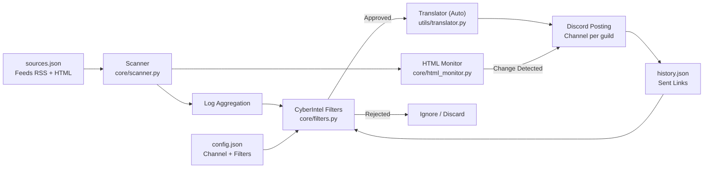

# 🔐 CyberIntel Bot — Cybersecurity Intelligence System

<p align="center">
  
</p>

<p align="center">
  
  
  
  
</p>

<p align="center">
  <b>Smart Intelligence Monitoring for Cybersecurity Feeds (RSS/Atom/YouTube)</b><br>
  Surgical Filtering • Interactive Dashboard • Automated Discord Posting
</p>

---

## 📋 Table of Contents

- [✨ Features](#-features)
- [🧱 Architecture](#-architecture)
- [🚀 Installation](#-installation)
- [⚙️ Configuration](#️-configuration)
- [🧰 Commands](#-commands)
- [🎛️ Dashboard](#️-dashboard)
- [🧠 Filter System](#-filter-system)
- [🖥️ Deploy](#️-deploy)
- [📜 License](#-license)

---

## ✨ Features

| Feature | Description |
|---------|-----------|
| 📡 **Periodic Scanner** | Scans RSS/Atom/YouTube feeds every 30 minutes (configurable). |
| 🕵️ **HTML Watcher** | Monitors official sites without RSS (e.g. CISA, NIST) detecting visual changes. |
| 🎛️ **Persistent Dashboard** | Interactive panel with buttons that works even after restarts. |
| 🎯 **Category Filters** | Malware, Ransomware, Vulnerability, Exploit + "ALL" option. |
| 🛡️ **Anti-Spam** | Blacklist to block generic or unrelated tech news. |
| 🔄 **Deduplication** | Never repeats news (history in `history.json`). |
| 🌐 **Multi-Guild** | Independent configuration per Discord server. |
| 🎨 **Rich Embeds** | Premium visual style (Matrix Green, thumbnails, timestamps). |
| 🎞️ **Native Player** | YouTube/Twitch videos play directly in chat. |
| 🌍 **Multi-Language** | Supports EN, PT, ES, IT, JA (auto-detection + `/setlang`). |
| 🔐 **SSL Secure** | Verified connections with certifi (MITM protection). |

---

## 🧱 Architecture

### Data Flow



---

## 🚀 Installation

### Prerequisites

- Python 3.10+
- Discord Bot Token ([Developer Portal](https://discord.com/developers/applications))

### Quick Start

```bash
# 1. Clone repository
git clone https://github.com/carmipa/cyberintel-discord.git
cd cyberintel-discord

# 2. Create virtual env
python -m venv .venv
source .venv/bin/activate  # Linux/Mac
# .venv\Scripts\activate   # Windows

# 3. Install dependencies
pip install -r requirements.txt

# 4. Configure env
cp .env.example .env
# Edit .env with your token
```

---

## ⚙️ Configuration

### Environment Variables (`.env`)

```env
DISCORD_TOKEN=your_token_here
COMMAND_PREFIX=!
LOOP_MINUTES=30
LOG_LEVEL=INFO
```

### Feed Sources (`sources.json`)

```json
{
  "rss_feeds": [
    "https://feeds.feedburner.com/TheHackersNews",
    "https://www.bleepingcomputer.com/feed/"
  ],
  "youtube_feeds": [
    "https://www.youtube.com/feeds/videos.xml?channel_id=UC9-y-6csu5WGm29I7JiwpnA"
  ]
}
```

---

## 🧰 Commands

| Command | Type | Description |
|---------|------|-----------|
| `/dashboard` | Slash | Opens configuration dashboard (Admin) |
| `/setlang` | Slash | Sets bot language for the server (Admin) |
| `/forcecheck` | Slash | Forces immediate scan (Admin) |
| `/status` | Slash | Shows bot statistics (Uptime, Scans) |
| `/feeds` | Slash | Lists all monitored sources |

---

## 🎛️ Dashboard

The interactive panel allows you to configure which categories to monitor:

- 🦠 **Malware**
- 🔒 **Ransomware**
- 🛡️ **Vulnerability**
- 💥 **Exploit**
- 🕵️ **Zero-Day**

---

## 📜 License

This project is licensed under the **MIT License**.

---

<p align="center">
  🔐 <i>CyberIntel System — Secure the network. Protect the future.</i>
</p>
