# 🛡️ CyberIntel SOC Bot

<div align="center">

<p align="center">
  
</p>

<div align="center">


**Sistema Avançado de Threat Intelligence & Defesa Ativa**  
**Advanced Threat Intelligence & Active Defense System**

[](https://opensource.org/licenses/MIT)
[](https://github.com/carmipa/projeto-cyberseguranca-bot/stargazers)
[](https://github.com/carmipa/projeto-cyberseguranca-bot/network)
[](https://github.com/carmipa/projeto-cyberseguranca-bot/issues)

**🇧🇷 [Português](#-português) • 🇺🇸 [English](#-english)**

</div>

---

## 🇧🇷 Português

### 📋 Índice

- [✨ Sobre o Projeto](#-sobre-o-projeto)
- [🎯 Funcionalidades Principais](#-funcionalidades-principais)
- [🏗️ Arquitetura do Sistema](#️-arquitetura-do-sistema)
- [🚀 Início Rápido](#-início-rápido)
- [🐳 Deploy com Docker](#-deploy-com-docker)
- [⚙️ Configuração](#️-configuração)
- [🧰 Comandos Disponíveis](#-comandos-disponíveis)
- [📊 Estrutura do Projeto](#-estrutura-do-projeto)
- [🔌 Integrações e APIs](#-integrações-e-apis)
- [🛡️ Segurança](#️-segurança)
- [📈 Monitoramento e Logs](#-monitoramento-e-logs)
- [📚 Documentação Completa](#-documentação-completa)

---

### ✨ Sobre o Projeto

O **CyberIntel SOC Bot** é uma solução completa de **Threat Intelligence** desenvolvida para automatizar a coleta, análise e distribuição de inteligência cibernética em tempo real. O sistema funciona como o núcleo de um **SOC (Security Operations Center) pessoal**, integrando múltiplas fontes de informação e APIs de segurança Tier 1 em uma interface unificada via Discord.

#### 🎯 Objetivo

Automatizar completamente o processo de varredura de informações de segurança, coletando dados de:

- 📰 **Feeds RSS/Atom** (The Hacker News, BleepingComputer, Krebs, DarkReading, Exploit-DB, Zero Day Initiative, CVE Details, Recorded Future, MITRE ATT&CK Updates)
- 🎥 **Canais YouTube** de segurança (Mental Outlaw, David Bombal, NetworkChuck, John Hammond, The Cyber Mentor, LiveOverflow, Black Hills Information Security)
- 🛡️ **APIs de Threat Intelligence** (NVD/NIST, AlienVault OTX, GreyNoise, Shodan\[opcional])
- 🌐 **Sites Oficiais e Regulatórios** (CISA, NIST, CERT.br, ANPD, ENISA)
- 🔍 **Análise de URLs** (URLScan.io, VirusTotal)

---

### 🎯 Funcionalidades Principais

#### 🛰️ Agregação de Inteligência Multicamadas

| Recurso | Descrição | Status |
|---------|-----------|--------|
| 📡 **Multi-Source Scanner** | Varre feeds RSS, Atom, YouTube e APIs simultaneamente | ✅ |
| 🔎 **NVD (NIST) Integration** | Monitoramento de CVEs críticas (CVSS > 7.0) | ✅ |
| 🛸 **AlienVault OTX** | Pulses de ameaças ativas e campanhas | ✅ |
| 🕵️ **HTML Monitor** | Detecção de mudanças em sites oficiais via hash | ✅ |
| 📺 **YouTube Feeds** | Monitoramento de canais de segurança | ✅ |

#### 🔍 Engine de Análise e Reputação

| Recurso | Descrição | Status |
|---------|-----------|--------|
| 🔗 **URL Scanner** | Análise via URLScan.io + VirusTotal | ✅ |
| 🎨 **Visual Severity Mapping** | Sistema de cores dinâmico (🔴 Crítico, 🟠 Alto, 🟢 Info) | ✅ |
| 🛡️ **Smart Filtering** | Filtros inteligentes por categoria | ✅ |
| 🔄 **Deduplication Engine** | Previne posts duplicados | ✅ |

#### 🛡️ Defesa Ativa e Segurança

| Recurso | Descrição | Status |
|---------|-----------|--------|
| 🚨 **Active Defense** | Sistema de honeypots para detecção de intrusão | ✅ |
| 🔐 **Malandro Protocol** | Proteção de comandos administrativos | ✅ |
| 🐳 **Container Isolation** | Deploy totalmente containerizado | ✅ |
| 📝 **Audit Logging** | Logs completos de todas as operações | ✅ |

---

### 🏗️ Arquitetura do Sistema

```mermaid
graph TB
    subgraph "🌐 Fontes de Inteligência"
        RSS[RSS Feeds]
        YT[YouTube Channels]
        API[APIs de Segurança]
        HTML[Sites Oficiais]
    end

    subgraph "🔧 Core System"
        Scanner[Scanner Loop]
        Filter[Engine de Filtros]
        Monitor[HTML Monitor]
    end

    subgraph "💾 Persistência"
        Config[config.json]
        History[history.json]
        State[state.json]
        DB[database.json]
    end

    subgraph "📤 Output"
        Discord[Discord Bot]
        NodeRED[Node-RED Dashboard]
    end

    RSS --> Scanner
    YT --> Scanner
    API --> Scanner
    HTML --> Monitor
    
    Scanner --> Filter
    Monitor --> Filter
    
    Filter --> Discord
    Filter --> NodeRED
```



📖 **[Documentação Completa de Arquitetura](./doc/ARCHITECTURE.md)**

---

### 🚀 Início Rápido

#### 📋 Pré-requisitos

- 🐳 **Docker** e **Docker Compose**
- 🔑 **Token do Discord Bot**
- (Opcional) **API Keys gratuitas** para serviços externos (todas têm planos free)

#### ⚡ Deploy Rápido (3 Passos)

```bash
# 1. Clone o repositório
git clone https://github.com/carmipa/projeto-cyberseguranca-bot.git
cd projeto-cyberseguranca-bot

# 2. Configure o .env
cp .env.example .env
nano .env  # Adicione DISCORD_TOKEN e OWNER_ID

# 3. Suba os containers
docker compose up -d --build
```

**✅ Pronto!** O bot está rodando e começará a varrer informações automaticamente.

📖 **[Guia Rápido Detalhado](./doc/QUICK_START.md)**

---

### 🐳 Deploy com Docker

```bash
# Ver logs em tempo real
docker compose logs -f cyber-bot

# Ver status
docker compose ps

# Reiniciar
docker compose restart cyber-bot

# Atualizar código
git pull && docker compose up -d --build
```

📖 **[Guia Completo de Deploy](./doc/DEPLOY.md)**

---

### ⚙️ Configuração

#### 🆓 APIs Gratuitas Disponíveis

**Todas as APIs integradas têm planos gratuitos!** Você pode usar o bot sem nenhuma chave, mas algumas funcionalidades serão limitadas:

| API | Status | Como Obter | Limite Free |
|-----|--------|------------|-------------|
| **NVD (NIST)** | ✅ Opcional | [Request API Key](https://nvd.nist.gov/developers/request-an-api-key) | Sem chave: 5 req/30s<br>Com chave: 50 req/30s |
| **AlienVault OTX** | ✅ Gratuita | [Registre-se](https://otx.alienvault.com/api) | Ilimitado |
| **URLScan.io** | ✅ Gratuita | [Registre-se](https://urlscan.io/user/signup) | 10 scans/dia |
| **VirusTotal** | ✅ Gratuita | [Registre-se](https://www.virustotal.com/gui/join-us) | 4 req/min |
| **GreyNoise Community** | ✅ Gratuita | [Registre-se](https://www.greynoise.io/viz/signup) | 50 req/dia |
| **Shodan** | ✅ Gratuita | [Registre-se](https://account.shodan.io/register) | 100 resultados/mês |
| **Ransomware.live** | ✅ Totalmente Gratuita | ❌ Não precisa de chave | Ilimitado |

> 💡 **Dica:** O bot funciona perfeitamente sem nenhuma chave! As APIs são opcionais e apenas aumentam os recursos disponíveis.

#### 🔐 Arquivo `.env`

```env
# Obrigatório
DISCORD_TOKEN=seu_token_discord_aqui
OWNER_ID=seu_id_discord

# Opcional - APIs Gratuitas (todas têm planos free)
# NVD: Opcional - funciona sem chave, mas com limite menor. Obtenha em: https://nvd.nist.gov/developers/request-an-api-key
NVD_API_KEY=
# OTX: Gratuita - Registre em: https://otx.alienvault.com/api
OTX_API_KEY=
# URLScan: Gratuita - Registre em: https://urlscan.io/user/signup
URLSCAN_API_KEY=
# VirusTotal: Gratuita (limitada) - Registre em: https://www.virustotal.com/gui/join-us
VT_API_KEY=
# GreyNoise Community: Gratuita - Registre em: https://www.greynoise.io/viz/signup
GREYNOISE_API_KEY=
# Shodan: Gratuita (limitada) - Registre em: https://account.shodan.io/register
SHODAN_API_KEY=

# Configurações
LOOP_MINUTES=30
LOG_LEVEL=INFO
DEPLOY_ENV=production

# Dashboard (Node-RED)
# Opção 1: Túnel SSH (recomendado para produção)
DASHBOARD_PUBLIC_URL=http://localhost:1880/ui
# Opção 2: IP público direto (menos seguro)
# DASHBOARD_PUBLIC_URL=http://IP_DA_VPS:1880/ui
# Opção 3: Domínio com HTTPS (mais seguro)
# DASHBOARD_PUBLIC_URL=https://seu-dominio-soc.com/ui
```

---

### 🧰 Comandos Disponíveis

#### 📡 Inteligência e Status

| Comando | Descrição | Permissão |
|---------|-----------|-----------|
| `/news` | Últimas 5 notícias de cibersegurança | Todos |
| `/cve [id]` | Detalhes de uma CVE (ex.: CVE-2021-44228) via NVD | Todos |
| `/scan [url]` | Analisa URL suspeita (URLScan.io + VirusTotal) | Todos |
| `/status` | Saúde do bot (uptime, CPU, RAM, estatísticas) | Todos |
| `/soc_status` | Conectividade com APIs (NVD, OTX, VirusTotal) | Todos |
| `/ping` | Latência com os servidores do Discord | Todos |
| `/about` | Informações técnicas do sistema | Todos |
| `/feeds` | Lista de feeds e fontes monitoradas | Todos |
| `/help` | Lista de comandos disponíveis | Todos |

#### 🖥️ Dashboard e Monitoramento

| Comando | Descrição | Permissão |
|---------|-----------|-----------|
| `/dashboard` | Acesso ao SOC Dashboard (Node-RED) e **métricas NVD 24h** (críticas/altas) | Todos |
| `/monitor` | Status do SOC e link para abrir o painel em tempo real | Todos |

#### ⚙️ Administração

| Comando | Descrição | Permissão |
|---------|-----------|-----------|
| `/set_channel` | Define o canal atual para alertas do SOC | Admin |
| `/forcecheck` | Força varredura imediata em todos os feeds | Admin |
| `/force_scan` | Força varredura e posta novidades no canal | Admin |
| `/post_latest` | Força a postagem da notícia mais recente (ignora cache) | Admin |
| `/now` | Dispara varredura manual com feedback no chat | Admin |
| `/server_log` | Últimas linhas do log do servidor (`logs/bot.log`) | Admin |
| `/status_db` | Estatísticas do banco de dados de inteligência | Admin |

#### 🔐 Segurança (Defesa Ativa)

| Comando | Descrição | Permissão |
|---------|-----------|-----------|
| `/admin_panel` | Painel restrito ao dono (OWNER_ID). Quem não for o dono é registrado como intruso (honeypot). | Apenas dono |

📖 **[Tutorial Completo](./doc/TUTORIAL.md)** • **[Tabela de referência de todos os comandos](./doc/COMANDOS_BOT.md)**

---

### 📊 Estrutura do Projeto

| Pasta/Arquivo | Descrição |
|---------------|-----------|
| `bot/` | Cogs do Discord (comandos slash: news, cve, dashboard, admin, etc.) |
| `core/` | Scanner, filtros, monitor HTML, estatísticas |
| `src/` | Serviços (CVE/NVD, threat intel, banco) |
| `doc/` | Documentação (deploy, tutorial, arquitetura, README PT/EN) |
| `tests/` | Testes automatizados (integração, CVE, etc.) |
| `logs/` | Logs da aplicação (ex.: `bot.log`) |
| `README.md` | Este arquivo (apenas na raiz) |
| `config.json`, `sources.json`, `state.json`, `history.json` | Configuração e estado do scanner |

---

### 📚 Documentação Completa

| Documento | Descrição |
|-----------|-----------|
| 📖 **[README_PT.md](./doc/README_PT.md)** | Documentação técnica completa (PT-BR) |
| 🇺🇸 **[README_EN.md](./doc/README_EN.md)** | English Documentation |
| 🧰 **[COMANDOS_BOT.md](./doc/COMANDOS_BOT.md)** | Tabela de referência: cada comando e para que serve |
| 🐳 **[DEPLOY.md](./doc/DEPLOY.md)** | Guia de deploy em VPS |
| ⚡ **[QUICK_START.md](./doc/QUICK_START.md)** | Guia rápido |
| 🎮 **[TUTORIAL.md](./doc/TUTORIAL.md)** | Tutorial de comandos |
| 🏗️ **[ARCHITECTURE.md](./doc/ARCHITECTURE.md)** | Arquitetura do sistema |

---

## 🇺🇸 English

### 📋 Table of Contents

- [✨ About the Project](#-about-the-project)
- [🎯 Main Features](#-main-features)
- [🏗️ System Architecture](#️-system-architecture)
- [🚀 Quick Start](#-quick-start)
- [🐳 Docker Deployment](#-docker-deployment)
- [⚙️ Configuration](#️-configuration)
- [🧰 Available Commands](#-available-commands)
- [📊 Project Structure](#-project-structure)
- [🔌 Integrations and APIs](#-integrations-and-apis)
- [🛡️ Security](#️-security)
- [📈 Monitoring and Logs](#-monitoring-and-logs)
- [📚 Complete Documentation](#-complete-documentation)

---

### ✨ About the Project

The **CyberIntel SOC Bot** is a complete **Threat Intelligence** solution designed to automate the collection, analysis, and distribution of cybersecurity intelligence in real-time. The system acts as the core of a **personal SOC (Security Operations Center)**, integrating multiple information sources and Tier 1 security APIs into a unified interface via Discord.

#### 🎯 Objective

Fully automate the security information scanning process, collecting data from:

- 📰 **RSS/Atom Feeds** (The Hacker News, BleepingComputer, Krebs, DarkReading, Exploit-DB, Zero Day Initiative, CVE Details, Recorded Future, MITRE ATT&CK Updates)
- 🎥 **YouTube Channels** (Mental Outlaw, David Bombal, NetworkChuck, John Hammond, The Cyber Mentor, LiveOverflow, Black Hills Information Security)
- 🛡️ **Threat Intelligence APIs** (NVD/NIST, AlienVault OTX, GreyNoise, Shodan\[optional])
- 🌐 **Official & Regulatory Sites** (CISA, NIST, CERT.br, ANPD, ENISA)
- 🔍 **URL Analysis** (URLScan.io, VirusTotal)

---

### 🎯 Main Features

#### 🛰️ Multi-Layer Intelligence Aggregation

| Feature | Description | Status |
|---------|-------------|--------|
| 📡 **Multi-Source Scanner** | Scans RSS, Atom, YouTube feeds and APIs simultaneously | ✅ |
| 🔎 **NVD (NIST) Integration** | Critical CVE monitoring (CVSS > 7.0) | ✅ |
| 🛸 **AlienVault OTX** | Active threat pulses and campaigns | ✅ |
| 🕵️ **HTML Monitor** | Change detection on official sites via hash | ✅ |
| 📺 **YouTube Feeds** | Security channel monitoring | ✅ |

#### 🔍 Analysis and Reputation Engine

| Feature | Description | Status |
|---------|-------------|--------|
| 🔗 **URL Scanner** | Analysis via URLScan.io + VirusTotal | ✅ |
| 🎨 **Visual Severity Mapping** | Dynamic color system (🔴 Critical, 🟠 High, 🟢 Info) | ✅ |
| 🛡️ **Smart Filtering** | Intelligent filters by category | ✅ |
| 🔄 **Deduplication Engine** | Prevents duplicate posts | ✅ |

#### 🛡️ Active Defense and Security

| Feature | Description | Status |
|---------|-------------|--------|
| 🚨 **Active Defense** | Honeypot system for intrusion detection | ✅ |
| 🔐 **Malandro Protocol** | Administrative command protection | ✅ |
| 🐳 **Container Isolation** | Fully containerized deployment | ✅ |
| 📝 **Audit Logging** | Complete logs of all operations | ✅ |

---

### 🏗️ System Architecture

```mermaid
graph TB
    subgraph "🌐 Intelligence Sources"
        RSS[RSS Feeds]
        YT[YouTube Channels]
        API[Security APIs]
        HTML[Official Sites]
    end

    subgraph "🔧 Core System"
        Scanner[Scanner Loop]
        Filter[Filter Engine]
        Monitor[HTML Monitor]
    end

    subgraph "💾 Persistence"
        Config[config.json]
        History[history.json]
        State[state.json]
        DB[database.json]
    end

    subgraph "📤 Output"
        Discord[Discord Bot]
        NodeRED[Node-RED Dashboard]
    end

    RSS --> Scanner
    YT --> Scanner
    API --> Scanner
    HTML --> Monitor
    
    Scanner --> Filter
    Monitor --> Filter
    
    Filter --> Discord
    Filter --> NodeRED
```



📖 **[Complete Architecture Documentation](./doc/ARCHITECTURE.md)**

---

### 🚀 Quick Start

#### 📋 Prerequisites

- 🐳 **Docker** and **Docker Compose**
- 🔑 **Discord Bot Token**
- (Optional) **Free API Keys** for external services (all have free tiers)

#### ⚡ Quick Deployment (3 Steps)

```bash
# 1. Clone repository
git clone https://github.com/carmipa/projeto-cyberseguranca-bot.git
cd projeto-cyberseguranca-bot

# 2. Configure .env
cp .env.example .env
nano .env  # Add DISCORD_TOKEN and OWNER_ID

# 3. Start containers
docker compose up -d --build
```

**✅ Done!** The bot is running and will start scanning information automatically.

📖 **[Detailed Quick Start Guide](./doc/QUICK_START.md)**

---

### 🐳 Docker Deployment

```bash
# View real-time logs
docker compose logs -f cyber-bot

# Check status
docker compose ps

# Restart
docker compose restart cyber-bot

# Update code
git pull && docker compose up -d --build
```

📖 **[Complete Deployment Guide](./doc/DEPLOY.md)**

---

### ⚙️ Configuration

#### 🆓 Available Free APIs

**All integrated APIs have free tiers!** You can use the bot without any keys, but some features will be limited:

| API | Status | How to Get | Free Limit |
|-----|--------|------------|------------|
| **NVD (NIST)** | ✅ Optional | [Request API Key](https://nvd.nist.gov/developers/request-an-api-key) | Without key: 5 req/30s<br>With key: 50 req/30s |
| **AlienVault OTX** | ✅ Free | [Sign Up](https://otx.alienvault.com/api) | Unlimited |
| **URLScan.io** | ✅ Free | [Sign Up](https://urlscan.io/user/signup) | 10 scans/day |
| **VirusTotal** | ✅ Free | [Sign Up](https://www.virustotal.com/gui/join-us) | 4 req/min |
| **GreyNoise Community** | ✅ Free | [Sign Up](https://www.greynoise.io/viz/signup) | 50 req/day |
| **Shodan** | ✅ Free | [Sign Up](https://account.shodan.io/register) | 100 results/month |
| **Ransomware.live** | ✅ Completely Free | ❌ No key needed | Unlimited |

> 💡 **Tip:** The bot works perfectly without any keys! APIs are optional and only increase available resources.

#### 🔐 `.env` File

```env
# Required
DISCORD_TOKEN=your_discord_token_here
OWNER_ID=your_discord_id

# Optional - Free APIs (all have free tiers)
# NVD: Optional - works without key but with lower rate limit. Get at: https://nvd.nist.gov/developers/request-an-api-key
NVD_API_KEY=
# OTX: Free - Register at: https://otx.alienvault.com/api
OTX_API_KEY=
# URLScan: Free - Register at: https://urlscan.io/user/signup
URLSCAN_API_KEY=
# VirusTotal: Free (limited) - Register at: https://www.virustotal.com/gui/join-us
VT_API_KEY=
# GreyNoise Community: Free - Register at: https://www.greynoise.io/viz/signup
GREYNOISE_API_KEY=
# Shodan: Free (limited) - Register at: https://account.shodan.io/register
SHODAN_API_KEY=

# Settings
LOOP_MINUTES=30
LOG_LEVEL=INFO
DEPLOY_ENV=production

# Dashboard (Node-RED)
# Option 1: SSH Tunnel (recommended for production)
DASHBOARD_PUBLIC_URL=http://localhost:1880/ui
# Option 2: Direct public IP (less secure)
# DASHBOARD_PUBLIC_URL=http://YOUR_VPS_IP:1880/ui
# Option 3: Domain with HTTPS (most secure)
# DASHBOARD_PUBLIC_URL=https://your-soc-domain.com/ui
```

---

### 🧰 Available Commands

#### 📡 Intelligence and Status

| Command | Description | Permission |
|---------|-------------|------------|
| `/news` | Latest 5 cybersecurity news | All |
| `/cve [id]` | CVE details (e.g. CVE-2021-44228) via NVD | All |
| `/scan [url]` | Analyze suspicious URL (URLScan.io + VirusTotal) | All |
| `/status` | Bot health (uptime, CPU, RAM, stats) | All |
| `/soc_status` | Connectivity with APIs (NVD, OTX, VirusTotal) | All |
| `/ping` | Latency to Discord servers | All |
| `/about` | Technical system information | All |
| `/feeds` | List of monitored feeds and sources | All |
| `/help` | List of available commands | All |

#### 🖥️ Dashboard and Monitoring

| Command | Description | Permission |
|---------|-------------|------------|
| `/dashboard` | SOC Dashboard (Node-RED) access and **NVD 24h metrics** (critical/high) | All |
| `/monitor` | SOC status and link to open the panel in real time | All |

#### ⚙️ Administration

| Command | Description | Permission |
|---------|-------------|------------|
| `/set_channel` | Set current channel for SOC alerts | Admin |
| `/forcecheck` | Force immediate scan of all feeds | Admin |
| `/force_scan` | Force scan and post new items to channel | Admin |
| `/post_latest` | Force post latest news (bypass cache) | Admin |
| `/now` | Trigger manual scan with chat feedback | Admin |
| `/server_log` | Latest server log lines (`logs/bot.log`) | Admin |
| `/status_db` | Intelligence database statistics | Admin |

#### 🔐 Security (Active Defense)

| Command | Description | Permission |
|---------|-------------|------------|
| `/admin_panel` | Owner-only panel (OWNER_ID). Non-owners are logged as intruders (honeypot). | Owner only |

📖 **[Complete Tutorial](./doc/TUTORIAL.md)** • **[Full command reference table](./doc/COMANDOS_BOT.md)**

---

### 📊 Project Structure

| Folder/File | Description |
|-------------|-------------|
| `bot/` | Discord cogs (slash commands: news, cve, dashboard, admin, etc.) |
| `core/` | Scanner, filters, HTML monitor, stats |
| `src/` | Services (CVE/NVD, threat intel, database) |
| `doc/` | Documentation (deploy, tutorial, architecture, README PT/EN) |
| `tests/` | Automated tests (integration, CVE, etc.) |
| `logs/` | Application logs (e.g. `bot.log`) |
| `README.md` | This file (root only) |
| `config.json`, `sources.json`, `state.json`, `history.json` | Scanner config and state |

---

### 📚 Complete Documentation

| Document | Description |
|----------|-------------|
| 📖 **[README_PT.md](./doc/README_PT.md)** | Complete technical documentation (PT-BR) |
| 🇺🇸 **[README_EN.md](./doc/README_EN.md)** | English Documentation |
| 🧰 **[COMANDOS_BOT.md](./doc/COMANDOS_BOT.md)** | Reference table: every command and what it does |
| 🐳 **[DEPLOY.md](./doc/DEPLOY.md)** | VPS deployment guide |
| ⚡ **[QUICK_START.md](./doc/QUICK_START.md)** | Quick start guide |
| 🎮 **[TUTORIAL.md](./doc/TUTORIAL.md)** | Commands tutorial |
| 🏗️ **[ARCHITECTURE.md](./doc/ARCHITECTURE.md)** | System architecture |

---

## 📜 License

This project is licensed under the **MIT License** - see the [LICENSE](LICENSE) file for details.

---

<div align="center">

**🔐 Protecting what matters with proactive intelligence**  
**🔐 Protegendo o que importa com inteligência proativa**

[⬆ Back to top](#-cyberintel-soc-bot)

Made with ❤️ by [Paulo Carminati](https://github.com/carmipa)

</div>
