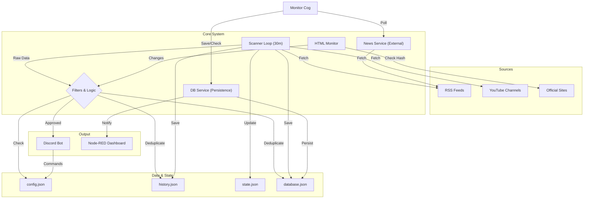

# 🔐 CyberIntel Bot — Cybersecurity Intelligence System

<p align="center">
  
</p>

<p align="center">
  <a href="https://github.com/carmipa/cyberintel-discord"></a>
  <a href="https://www.python.org/"></a>
  
  <a href="LICENSE"></a>
</p>

<p align="center">
  <b>Intelligent Cybersecurity Feed Monitoring (RSS/Atom/YouTube)</b><br>
  Surgical Filtering • Interactive Dashboard • Auto-posting to Discord • Data Persistence
</p>

---

## 📋 Table of Contents

- [✨ Features](#-features)
- [🧱 Detailed Architecture](#-detailed-architecture)
- [🚀 Step-by-Step Installation](#-step-by-step-installation)
- [⚙️ Advanced Configuration](#️-advanced-configuration)
- [🧰 Commands](#-commands)
- [🎛️ Dashboard](#️-dashboard)
- [🔧 Troubleshooting](#-troubleshooting)
- [📜 License](#-license)

---

## ✨ Features

| Feature | Description |
|---------|-----------|
| 📡 **Periodic Scanner** | Scans RSS/Atom/YouTube feeds every 30 minutes (configurable). |
| 🕵️ **HTML Watcher** | Monitors official non-RSS sites (e.g., CISA, NIST) for visual changes. |
| 🎛️ **Persistent Dashboard** | Interactive panel with buttons that work even after restart. |
| 🎯 **Category Filters** | Malware, Ransomware, Vulnerability, Exploit + "ALL" option. |
| 🛡️ **Anti-Spam** | Blacklist to block generic or irrelevant news. |
| 🔄 **Smart Deduplication** | Never repeats news (history in `history.json` and `database.json`). |
| 💾 **Data Persistence** | Tracks sent news with a local database (`data/database.json`). |
| 🌐 **Node-RED Integration** | Sends notifications to external dashboards via webhook. |
| 🎨 **Rich Embeds** | Premium visual style (Matrix Green, thumbnails, timestamps). |
| 🎞️ **Native Player** | YouTube/Twitch videos play directly in chat. |
| 🌍 **Multi-Language** | Support for EN, PT, ES, IT, JA (auto-detect + `/setlang`). |
| 🔐 **Secure SSL** | Verified connections with certifi (MITM protection). |

---

## 🧱 Detailed Architecture

The diagram below illustrates the data flow from collection to distribution. The system monitors various sources, processes the data through rigorous filters, and distributes actionable intelligence.



### Core Components

1. **Scanner Loop**: The heart of the system. Runs every `LOOP_MINUTES` (default: 30m). Orchestrates data collection from all configured sources.
2. **Filters & Logic**: Applies strict rules to ensure quality:
    - *Blacklist*: Blocks irrelevant terms (spam, ads, etc.).
    - *Core Keywords*: Ensures content is strictly about cybersecurity.
    - *Categorization*: Classifies into Malware, Ransomware, etc.
3. **Persistence (DBService)**: Ensures no duplicate news is sent by maintaining a hash of all processed links in `database.json`.
4. **Monitor Cog**: An independent module that runs in parallel to fetch "Breaking News" from high-priority sources, ensuring near real-time alerts.

---

## 🚀 Step-by-Step Installation

### Prerequisites

- **Python 3.10 or higher**: [Download Python](https://www.python.org/downloads/)
- **Git**: [Download Git](https://git-scm.com/downloads)
- **Discord Account**: To create the application and invite the bot.

### Procedure

1. **Clone the Repository**

    ```bash
    git clone https://github.com/carmipa/cyberintel-discord.git
    cd cyberintel-discord
    ```

2. **Set Up Virtual Environment (Recommended)**
    This isolates project dependencies.

    ```bash
    python -m venv .venv
    
    # Activate on Windows:
    .venv\Scripts\activate
    
    # Activate on Linux/Mac:
    source .venv/bin/activate
    ```

3. **Install Dependencies**

    ```bash
    pip install -r requirements.txt
    ```

    *If you encounter installation errors, try upgrading pip: `pip install --upgrade pip`*

4. **Environment Configuration (.env)**
    Copy the example file and edit it:

    ```bash
    cp .env.example .env
    ```

    Open `.env` and fill in:
    - `DISCORD_TOKEN`: Your token from the [Discord Developer Portal](https://discord.com/developers/applications).
    - `DISCORD_NEWS_CHANNEL_ID`: ID of the channel where news will be posted (enable Developer Mode in Discord to right-click and "Copy ID").

5. **Run the Bot**

    ```bash
    python main.py
    ```

---

## ⚙️ Advanced Configuration

### `sources.json`

This file controls where the bot gathers information. The structure must be strictly followed:

```json
{
  "rss_feeds": [
    "https://feeds.feedburner.com/TheHackersNews",
    "https://www.bleepingcomputer.com/feed/"
  ],
  "youtube_feeds": [
    "https://www.youtube.com/feeds/videos.xml?channel_id=UC9-y-6csu5WGm29I7JiwpnA"
  ],
   "official_sites_reference_(not_rss)": [
    "https://www.cisa.gov/cybersecurity-alerts-and-advisories"
  ]
}
```

- **rss_feeds**: List of direct RSS/Atom URLs.

- **youtube_feeds**: YouTube RSS links (do not use direct channel links, use the RSS format).

### `config.json`

Automatically generated. Stores preferences for each Guild (Server). **Do not edit manually** unless the bot is stopped.
Internal structure example:

```json
{
  "123456789012345678": {
    "channel_id": 987654321098765432,
    "language": "en_US",
    "filters": ["malware", "ransomware", "zero-day"]
  }
}
```

---

## 🔧 Troubleshooting

### The bot connects but posts nothing

1. Verify `DISCORD_NEWS_CHANNEL_ID` in `.env`.
2. Check bot permissions in the channel. It needs: **View Channel**, **Send Messages**, **Embed Links**.
3. Wait for the 30-minute cycle or use `/forcecheck`.

### "Intents" Errors

If you get an error about "Privileged Intents":

1. Go to the [Discord Developer Portal](https://discord.com/developers/applications).
2. Select your App -> Bot.
3. Scroll to "Privileged Gateway Intents".
4. Enable **Message Content Intent** and **Server Members Intent**.

### Broken Diagrams in README

If diagrams do not render, ensure you are viewing on GitHub (which supports Mermaid natively) or use a compatible Markdown viewer (VS Code with Mermaid extension).

---

## 📜 License

This project is licensed under the **MIT License**. See the LICENSE file for details.

---

<p align="center">
  🔐 <i>CyberIntel System — Secure the network. Secure the future.</i>
</p>
