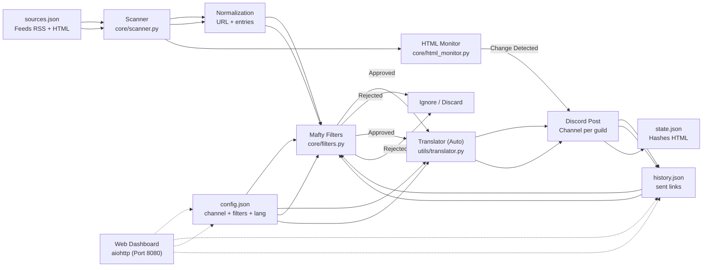
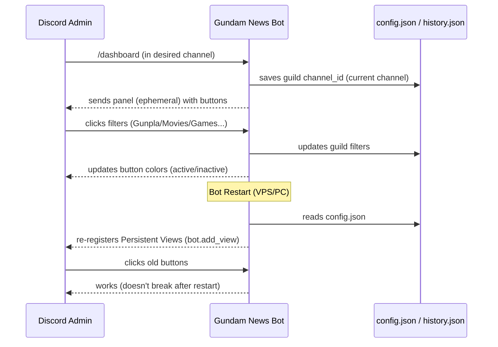
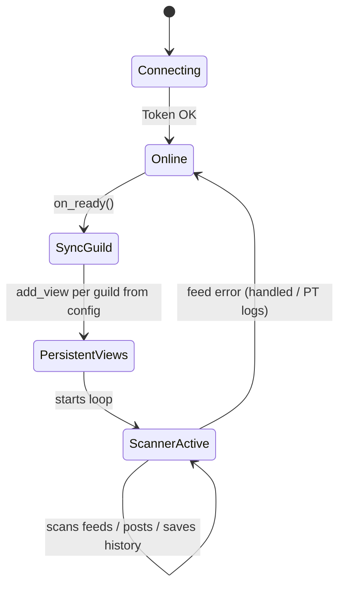
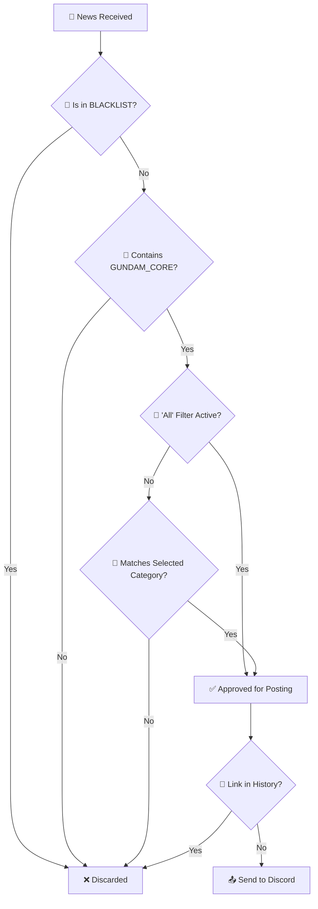

# 🛰️ Gundam News Bot — Mafty Intelligence System

<p align="center">
  
</p>

<p align="center">
  <a href="https://github.com/carmipa/gundam-news-discord/actions/workflows/python-app.yml">
    
  </a>
  
  
  
  
  
</p>

<p align="center">
  <b>Intelligent monitoring of RSS/Atom/YouTube feeds about the Gundam universe</b><br>
  Surgical filtering • Interactive Dashboard • Auto-posting to Discord
</p>

---

## 📋 Table of Contents

- [✨ Features](#-features)
- [🧱 Architecture](#-architecture)
- [🚀 Installation](#-installation)
- [⚙️ Configuration](#️-configuration)
- [🧰 Commands](#-commands)
- [🎛️ Dashboard](#️-dashboard)
- [🧠 Filter System](#-filter-system)
- [🖥️ Deploy](#️-deploy)
- [🧩 Troubleshooting](#-troubleshooting)
- [📜 License](#-license)

---

## ✨ Features

| Feature | Description |
|---------|-----------|
| 📡 **Periodic Scanner** | Scans RSS/Atom/YouTube feeds every 30 minutes (configurable) |
| 🕵️ **HTML Watcher** | Monitors official non-RSS sites (e.g., Gundam Official) for visual changes |
| 🎛️ **Persistent Dashboard** | Interactive panel with buttons that work even after restart |
| 🎯 **Category Filters** | Gunpla, Movies, Games, Music, Fashion + "ALL" option |
| 🛡️ **Anti-Spam** | Blacklist to block non-Gundam related anime/games |
| 🔄 **Deduplication** | Never repeats news (history in `history.json`) |
| 🌐 **Multi-Guild** | Independent configuration per Discord server |
| 📝 **Logs in PT-BR** | Clear messages for debugging and monitoring |
| 🎨 **Rich Embeds** | Premium looking news (Gundam color, thumbnails, timestamps) |
| 🎞️ **Native Player** | YouTube/Twitch videos play directly in chat (no browser needed) |
| 🌍 **Multi-Language** | Support for EN, PT, ES, IT, JA (auto-detect + `/setlang`) |
| 🖥️ **Web Dashboard** | Visual panel at <http://host:8080> with real-time status |
| 🧹 **Auto-Cleanup** | Automatic cache cleaning every 7 days for performance (Zero maintenance) |
| ❄️ **Cold Start** | Immediately posts top 3 recent news from new sources (bypassing time locks) |
| 🔐 **Secure SSL** | Verified connections with certifi (MITM protection) |

---

## 🧱 Architecture

### 1) Macro View — Full Data Flow



> **Legend:**
>
> - `sources.json` — List of monitored feeds
> - `config.json` — Channel and filter configuration per server
> - `history.json` — Sent links (deduplication)

---

### 2) `/dashboard` Command Flow and UI Persistence



> **Highlights:**
>
> - The panel is **ephemeral** (only you see it)
> - Buttons work **even after bot restart**
> - Configuration is **saved to disk** automatically

---

### 3) Main Bot States



> **Lifecycle:**
>
> 1. **Connecting** — Validating token
> 2. **Online** — Connected to Discord
> 3. **SyncGuild** — Syncing slash commands
> 4. **PersistentViews** — Restoring dashboard buttons
> 5. **ScannerActive** — Scan loop running

---

### 4) State Maintenance (Auto-Cleanup)

The bot features an autonomous maintenance system to prevent infinite cache growth:

- **7-Day Cycle**: Every week, the deduplication key (`dedup`) is automatically cleared.
- **Smart Cold Start**: Upon detecting a new source or recent cleanup, the bot enters "Cold Start" mode, allowing the **top 3 post recent news** to be posted immediately, bypassing restrictive time filters (while keeping content filters active).
- **Benefit**: Ensures the bot can run on resource-constrained environments without manual intervention.

---

## 🚀 Installation

### Prerequisites

- Python 3.10 or higher
- Discord Bot Token ([Developer Portal](https://discord.com/developers/applications))

### Step by Step

```bash
# 1. Clone the repository
git clone https://github.com/carmipa/gundam-news-discord.git
cd gundam-news-discord

# 2. Create virtual environment
python -m venv .venv

# Windows
.venv\Scripts\activate

# Linux/macOS
source .venv/bin/activate

# 3. Install dependencies
pip install -r requirements.txt

# 4. Configure environment
cp .env.example .env
# Edit .env with your token
```

---

## ⚙️ Configuration

### Environment Variables (`.env`)

```env
# Required
DISCORD_TOKEN=your_token_here

# Optional
COMMAND_PREFIX=!
LOOP_MINUTES=30
LOG_LEVEL=INFO  # Use DEBUG for detailed GRC logs
```

### Feed Sources (`sources.json`)

The bot accepts two formats:

<details>
<summary><b>📁 Category Format (Recommended)</b></summary>

```json
{
  "rss_feeds": [
    "https://www.animenewsnetwork.com/news/rss.xml",
    "https://gundamnews.org/feed"
  ],
  "youtube_feeds": [
    "https://www.youtube.com/feeds/videos.xml?channel_id=UCejtUitnpnf8Be-v5NuDSLw"
  ]
}
```

</details>

<details>
<summary><b>📁 Official Sites (HTML Monitoring)</b></summary>
Sites without RSS are placed in a separate array. The bot checks for hash changes.

```json
{
  "official_sites_reference_(not_rss)": [
    "https://gundam-official.com/",
    "https://en.gundam-official.com/news"
  ]
}
```

</details>

<details>
<summary><b>📁 Simple List Format</b></summary>

```json
[
  "https://www.animenewsnetwork.com/news/rss.xml",
  "https://gundamnews.org/feed"
]
```

</details>

---

## 🧰 Commands

| Command | Type | Description |
|---------|------|-----------|
| `/dashboard` | Slash | Opens filter configuration panel (Admin) |
| `/setlang` | Slash | Sets bot language for the server (Admin) |
| `/forcecheck` | Slash | Forces immediate scan (Admin) |
| `/status` | Slash | Shows bot statistics (Uptime, Scans, etc) |
| `/feeds` | Slash | Lists all monitored sources |
| `/help` | Slash | Shows help manual |
| `/invite` | Slash | Link to invite the bot |
| `!dashboard` | Prefix | Legacy: Same function as /dashboard |

> **🔒 Permission:** Only administrators can use these commands.

---

## 🎛️ Dashboard

The interactive panel allows configuring which categories to monitor:

| Button | Function |
|-------|--------|
| 🌟 **ALL** | Toggle all categories |
| 🤖 **Gunpla** | Kits, P-Bandai, Ver.Ka, HG/MG/RG/PG |
| 🎬 **Movies** | Anime, trailers, series, Hathaway, SEED |
| 🎮 **Games** | Gundam Games (GBO2, Breaker, etc.) |
| 🎵 **Music** | OST, albums, openings/endings |
| 👕 **Fashion** | Apparel and merchandise |
| 📌 **View Filters** | Shows active filters |
| 🔄 **Reset** | Clears all filters |

### Visual Indicators

- 🟢 **Green** = Filter active
- ⚪ **Gray** = Filter inactive

---

## 🧠 Filter System

The filtering is **not simple** — the bot uses a **layered** system to ensure surgical precision:

### Decision Flow



### ✅ Filtering Rules (real order)

| Step | Check | Action |
|-------|-------------|------|
| 1️⃣ | Join `title + summary` | Concatenate text |
| 2️⃣ | Clean HTML and normalize | Remove tags, extra spaces |
| 3️⃣ | **BLACKLIST** | If present (e.g., *One Piece*), block |
| 4️⃣ | **GUNDAM_CORE** | If no Gundam terms, block |
| 5️⃣ | 'All' filter active? | Allow everything if yes |
| 6️⃣ | Selected Category | Must match keywords |
| 7️⃣ | **Deduplication** | If link is already in `history.json`, ignore |

### 🎯 GUNDAM_CORE Terms

```
gundam, gunpla, mobile suit, universal century, rx-78, zaku, zeon, 
char, amuro, hathaway, mafty, seed, seed freedom, witch from mercury, 
g-witch, p-bandai, premium bandai, ver.ka, hg, mg, rg, pg, sd, fm, re/100
```

### 🚫 BLACKLIST (blocked)

```
one piece, dragon ball, naruto, bleach, pokemon, digimon, 
attack on titan, jujutsu, demon slayer
```

### 🔧 Where to adjust precision?

| Constant | Purpose |
|-----------|-----------|
| `GUNDAM_CORE` | Enforces "is Gundam" — add terms here |
| `BLACKLIST` | Cuts noise from generalist feeds |
| `CAT_MAP` | Adjusts triggers per category |

---

## 🖥️ Deploy

### Local (Development)

```bash
python main.py
```

### VPS with systemd (Production)

Create file `/etc/systemd/system/gundam-bot.service`:

```ini
[Unit]
Description=Gundam News Bot - Mafty Intel
After=network.target

[Service]
Type=simple
WorkingDirectory=/opt/gundam-bot
ExecStart=/opt/gundam-bot/.venv/bin/python main.py
Restart=always
RestartSec=5
User=gundam

[Install]
WantedBy=multi-user.target
```

Useful commands:

```bash
# Enable and start
sudo systemctl daemon-reload
sudo systemctl enable gundam-bot
sudo systemctl start gundam-bot

# Check status
sudo systemctl status gundam-bot

# View real-time logs
journalctl -u gundam-bot -f
```

### 🐳 VPS with Docker (Recommended for Production)

**Quick Install:**

```bash
# Clone the repository
git clone https://github.com/carmipa/gundam-news-discord.git
cd gundam-news-discord

# Configure .env with your token
cp .env.example .env
nano .env

# Start with Docker Compose
docker-compose up -d

# View logs
docker-compose logs -f
```

**Docker Benefits:**

- ✅ Auto-restart if crashes
- ✅ Complete system isolation
- ✅ Easy update (`git pull && docker-compose restart`)
- ✅ Log rotation
- ✅ Portable between servers

📖 **Complete Guide:** See [DEPLOY.md](DEPLOY.md) for detailed instructions.

---

## 🗂️ Project Structure

```
gundam-news-discord/
├── 📄 main.py              # Main Bot
├── 📄 settings.py          # Loads configuration from .env
├── 📄 sources.json         # List of monitored feeds
├── 📄 requirements.txt     # Python dependencies
├── 📄 .env.example         # Configuration example
├── 📄 .gitignore           # Git ignored files
├── 🖼️ icon.png             # Bot icon
├── 📁 .github/             # GitHub Actions Workflows
├── 📁 bot/                 # Bot logic (Cogs, Views)
├── 📁 core/                # System Core (Scanner, Filters, HTML Monitor)
├── 📁 tests/               # Automated tests
├── 📁 translations/        # Internationalization (i18n)
├── 📁 utils/               # Utilities (Logger, Helpers)
├── 📁 web/                 # Web Dashboard
└── 📄 README.md            # This documentation
```

> **Note:** Files `config.json` and `history.json` are generated automatically at runtime and are in `.gitignore`.

---

## 🧩 Troubleshooting

<details>
<summary><b>❌ CommandNotFound: Application command 'dashboard' not found</b></summary>

**Cause:** Discord global sync lag.

**Solution:** The bot already syncs per guild in `on_ready()`. Wait a few seconds after the bot connects.

</details>

<details>
<summary><b>❌ AttributeError: 'str' object has no attribute 'get'</b></summary>

**Cause:** Incorrect format of `sources.json`.

**Solution:** Check if the file is in one of the accepted formats (list or dictionary with categories).

</details>

<details>
<summary><b>⚠️ "PyNaCl is not installed… voice will NOT be supported"</b></summary>

**Not an error!** Just a warning. The bot does not use voice features, safely ignore.

</details>

---

## 🤝 Contributing

1. Fork the project
2. Create your feature branch (`git checkout -b feature/MyFeature`)
3. Commit your changes (`git commit -m 'Add MyFeature'`)
4. Push to the branch (`git push origin feature/MyFeature`)
5. Open a Pull Request

---

## 📜 License

This project is licensed under the **MIT License** - see the [LICENSE](LICENSE) file for details.

---

## 👨‍💻 Author

**Paulo André Carminati**  
[](https://github.com/carmipa)

---

<p align="center">
  🛰️ <i>Mafty Intelligence System — Vigilance for the Universal Century</i>
</p>
