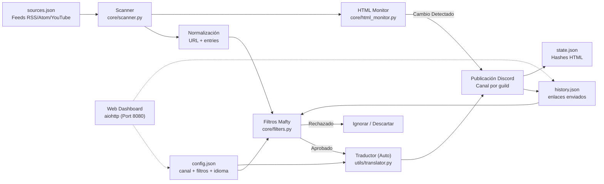
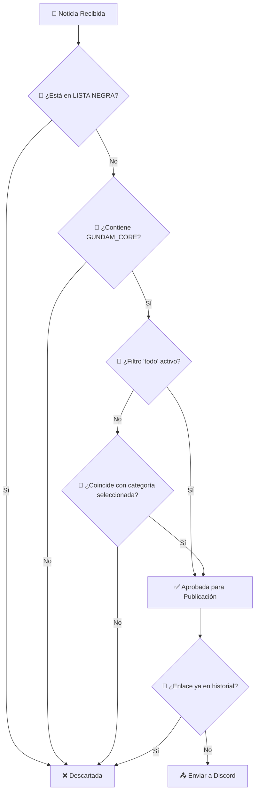

# 🛰️ Gundam News Bot — Mafty Intelligence System

<p align="center">
  
</p>

<p align="center">
  <a href="https://github.com/carmipa/gundam-news-discord/actions/workflows/python-app.yml">
    
  </a>
  
  
  
  
  
</p>

<p align="center">
  <b>Monitoreo inteligente de feeds RSS/Atom/YouTube sobre el universo Gundam</b><br>
  Filtrado quirúrgico • Dashboard interactivo • Publicación automática en Discord
</p>

---

## 📋 Índice

- [✨ Características](#-características)
- [🧱 Arquitectura](#-arquitectura)
- [🚀 Instalación](#-instalación)
- [⚙️ Configuración](#️-configuración)
- [🧰 Comandos](#-comandos)
- [🎛️ Dashboard](#️-dashboard)
- [🧠 Sistema de Filtros](#-sistema-de-filtros)
- [🖥️ Despliegue](#️-despliegue)
- [🧩 Solución de Problemas](#-solución-de-problemas)
- [📜 Licencia](#-licencia)

---

## ✨ Características

| Funcionalidad | Descripción |
|---------|-----------|
| 📡 **Escáner Periódico** | Escaneo de feeds RSS/Atom/YouTube cada 30 minutos (configurable) |
| 🕵️ **HTML Watcher** | Monitorea sitios oficiales sin RSS (ej: Gundam Official) detectando cambios visuales |
| 🎛️ **Dashboard Persistente** | Panel interactivo con botones que funcinan incluso tras reiniciar |
| 🎯 **Filtros por Categoría** | Gunpla, Películas, Juegos, Música, Moda + opción "TODO" |
| 🛡️ **Anti-Spam** | Lista negra para bloquear anime/juegos no relacionados con Gundam |
| 🔄 **Deduplicación** | Nunca repite noticias (historial en `history.json`) |
| 🌐 **Multi-Servidor** | Configuración independiente por servidor de Discord |
| 📝 **Logs Claros** | Mensajes de depuración y monitoreo detallados |
| 🎨 **Embeds Ricos** | Noticias con visual premium (color Gundam, miniaturas, marcas de tiempo) |
| 🎞️ **Reproductor Nativo** | Vídeos de YouTube/Twitch se reproducen directo en el chat (sin abrir navegador) |
| 🌍 **Multi-Idioma** | Soporte para EN, PT, ES, IT, JA (auto-detección + `/setlang`) |
| 🖥️ **Web Dashboard** | Panel visual en <http://host:8080> con estado en tiempo real |
| 🧹 **Auto-Limpieza** | Limpieza automática de caché cada 7 días para rendimiento (Cero mantenimiento) |
| ❄️ **Cold Start** | Publica inmediatamente las 3 noticias más recientes de nuevas fuentes (ignora bloqueos de tiempo) |
| 🔐 **SSL Seguro** | Conexiones verificadas con certifi (protección contra MITM) |

---

## 🧱 Arquitectura

### 1) Visión Macro — Flujo Completo de Datos



---

## 🚀 Instalación

### Requisitos previos

- Python 3.10 o superior
- Token de bot de Discord ([Portal de Desarrolladores](https://discord.com/developers/applications))

### Paso a paso

```bash
# 1. Clonar el repositorio
git clone https://github.com/carmipa/gundam-news-discord.git
cd gundam-news-discord

# 2. Crear entorno virtual
python -m venv .venv

# Windows
.venv\Scripts\activate

# Linux/macOS
source .venv/bin/activate

# 3. Instalar dependencias
pip install -r requirements.txt

# 4. Configurar el entorno
cp .env.example .env
# Edite el .env con su token
```

---

## ⚙️ Configuración

### Variables de Entorno (`.env`)

```env
# Obligatorio
DISCORD_TOKEN=tu_token_aqui

# Opcional
COMMAND_PREFIX=!
LOOP_MINUTES=30
LOG_LEVEL=INFO  # Use DEBUG para logs GRC detallados
```

### Fuentes de Feeds (`sources.json`)

El bot acepta dos formatos:

<details>
<summary><b>📁 Formato con categorías (recomendado)</b></summary>

```json
{
  "rss_feeds": [
    "https://www.animenewsnetwork.com/news/rss.xml",
  ],
  "youtube_feeds": [
    "https://www.youtube.com/feeds/videos.xml?channel_id=UCejtUitnpnf8Be-v5NuDSLw"
  ]
}
```

</details>

<details>
<summary><b>📁 Sitios Oficiales (Monitoreo HTML)</b></summary>
Sitios que no poseen RSS se colocan en un array separado. El bot verifica cambios de hash.

```json
{
  "official_sites_reference_(not_rss)": [
    "https://gundam-official.com/"
  ]
}
```

</details>

---

## 🧰 Comandos

| Comando | Tipo | Descripción |
|---------|------|-----------|
| `/dashboard` | Slash | Abre panel de configuración de filtros (Admin) |
| `/setlang` | Slash | Define el idioma del bot para el servidor (Admin) |
| `/forcecheck` | Slash | Fuerza un escaneo inmediato (Admin) |
| `/status` | Slash | Muestra estadísticas del bot (Tiempo de actividad, Escaneos, etc) |
| `/feeds` | Slash | Lista todas las fuentes monitoreadas |
| `/help` | Slash | Muestra manual de ayuda |
| `/invite` | Slash | Enlace para invitar al bot |

> **🔒 Permiso:** Solo administradores pueden usar estos comandos.

---

## 🎛️ Dashboard

El panel interactivo permite configurar qué categorías monitorear:

| Botón | Función |
|-------|--------|
| 🌟 **TODO** | Activa/desactiva todas las categorías |
| 🤖 **Gunpla** | Kits, P-Bandai, Ver.Ka, HG/MG/RG/PG |
| 🎬 **Películas** | Anime, trailers, series, Hathaway, SEED |
| 🎮 **Juegos** | Juegos Gundam (GBO2, Breaker, etc.) |
| 🎵 **Música** | OST, álbumes, openings/endings |
| 👕 **Moda** | Ropa y merchandise |
| 📌 **Ver filtros** | Muestra filtros activos |
| 🔄 **Reset** | Limpia todos los filtros |

---

## 🧠 Sistema de Filtros

El filtrado **no es simple** — el bot usa un sistema en **capas** para garantizar precisión quirúrgica:

### Flujo de Decisión



---

## 🖥️ Despliegue

### Docker (Recomendado)

```bash
docker-compose up -d
```

Ver [DEPLOY.md](DEPLOY.md) para más detalles.

---

## 📜 Licencia

Este proyecto está bajo la **MIT License** - vea el archivo [LICENSE](LICENSE) para detalles.

---

<p align="center">
  🛰️ <i>Mafty Intelligence System — Vigilancia continua del Universal Century</i>
</p>
