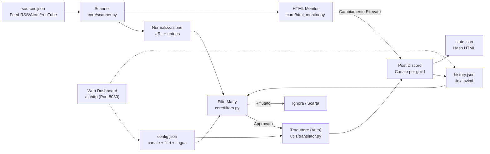
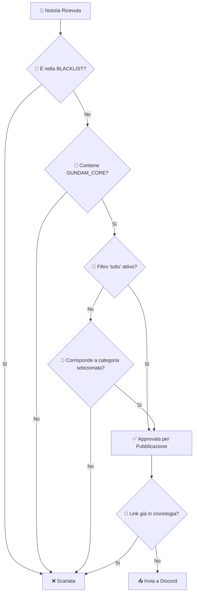

# 🛰️ Gundam News Bot — Mafty Intelligence System

<p align="center">
  
</p>

<p align="center">
  <a href="https://github.com/carmipa/gundam-news-discord/actions/workflows/python-app.yml">
    
  </a>
  
  
  
  
  
</p>

<p align="center">
  <b>Monitoraggio intelligente di feed RSS/Atom/YouTube sull'universo Gundam</b><br>
  Filtraggio chirurgico • Dashboard interattiva • Pubblicazione automatica su Discord
</p>

---

## 📋 Indice

- [✨ Funzionalità](#-funzionalità)
- [🧱 Architettura](#-architettura)
- [🚀 Installazione](#-installazione)
- [⚙️ Configurazione](#️-configurazione)
- [🧰 Comandi](#-comandi)
- [🎛️ Dashboard](#️-dashboard)
- [🧠 Sistema di Filtri](#-sistema-di-filtri)
- [🖥️ Deploy](#️-deploy)
- [🧩 Risoluzione Problemi](#-risoluzione-problemi)
- [📜 Licenza](#-licenza)

---

## ✨ Funzionalità

| Funzionalità | Descrizione |
|---------|-----------|
| 📡 **Scanner Periodico** | Scansione di feed RSS/Atom/YouTube ogni 30 minuti (configurabile) |
| 🕵️ **HTML Watcher** | Monitora siti ufficiali senza RSS (es: Gundam Official) rilevando cambiamenti visivi |
| 🎛️ **Dashboard Persistente** | Pannello interattivo con pulsanti che funzionano anche dopo il riavvio |
| 🎯 **Filtri per Categoria** | Gunpla, Film, Giochi, Musica, Moda + opzione "TUTTO" |
| 🛡️ **Anti-Spam** | Blacklist per bloccare anime/giochi non correlati a Gundam |
| 🔄 **Deduplicazione** | Non ripete mai le notizie (cronologia in `history.json`) |
| 🌐 **Multi-Guild** | Configurazione indipendente per server Discord |
| 📝 **Log Chiari** | Messaggi di debug e monitoraggio dettagliati |
| 🎨 **Embed Ricchi** | Notizie con visual premium (colore Gundam, miniature, timestamp) |
| 🎞️ **Player Nativo** | Video YouTube/Twitch riprodotti direttamente nella chat (senza aprire browser) |
| 🌍 **Multi-Lingua** | Supporto per EN, PT, ES, IT, JA (rilevamento automatico + `/setlang`) |
| 🖥️ **Web Dashboard** | Pannello visivo su <http://host:8080> con stato in tempo reale |
| 🧹 **Auto-Pulizia** | Pulizia automatica della cache ogni 7 giorni per prestazioni (Manutenzione Zero) |
| ❄️ **Cold Start** | Pubblica immediatamente le 3 notizie più recenti da nuove fonti (ignora blocchi temporali) |
| 🔐 **SSL Sicuro** | Connessioni verificate con certifi (protezione contro MITM) |

---

## 🧱 Architettura

### 1) Visione Macro — Flusso Completo dei Dati



---

## 🚀 Installazione

### Prerequisiti

- Python 3.10 o superiore
- Token bot Discord ([Portale Sviluppatori](https://discord.com/developers/applications))

### Passo dopo passo

```bash
# 1. Clona il repository
git clone https://github.com/carmipa/gundam-news-discord.git
cd gundam-news-discord

# 2. Crea ambiente virtuale
python -m venv .venv

# Windows
.venv\Scripts\activate

# Linux/macOS
source .venv/bin/activate

# 3. Installa dipendenze
pip install -r requirements.txt

# 4. Configura l'ambiente
cp .env.example .env
# Modifica .env con il tuo token
```

---

## ⚙️ Configurazione

### Variabili d'Ambiente (`.env`)

```env
# Obbligatorio
DISCORD_TOKEN=il_tuo_token_qui

# Opzionale
COMMAND_PREFIX=!
LOOP_MINUTES=30
LOG_LEVEL=INFO  # Usa DEBUG per log GRC dettagliati
```

### Fonti Feed (`sources.json`)

Il bot accetta due formati:

<details>
<summary><b>📁 Formato con categorie (consigliato)</b></summary>

```json
{
  "rss_feeds": [
    "https://www.animenewsnetwork.com/news/rss.xml",
  ],
  "youtube_feeds": [
    "https://www.youtube.com/feeds/videos.xml?channel_id=UCejtUitnpnf8Be-v5NuDSLw"
  ]
}
```

</details>

<details>
<summary><b>📁 Sito Ufficiali (Monitoraggio HTML)</b></summary>
I siti senza RSS sono inseriti in un array separato. Il bot controlla i cambiamenti di hash.

```json
{
  "official_sites_reference_(not_rss)": [
    "https://gundam-official.com/"
  ]
}
```

</details>

---

## 🧰 Comandi

| Comando | Tipo | Descrizione |
|---------|------|-----------|
| `/dashboard` | Slash | Apre pannello configurazione filtri (Admin) |
| `/setlang` | Slash | Imposta la lingua del bot per il server (Admin) |
| `/forcecheck` | Slash | Forza una scansione immediata (Admin) |
| `/status` | Slash | Mostra statistiche del bot (Uptime, Scansioni, ecc) |
| `/feeds` | Slash | Elenca tutte le fonti monitorate |
| `/help` | Slash | Mostra manuale di aiuto |
| `/invite` | Slash | Link per invitare il bot |

> **🔒 Permessi:** Solo gli amministratori possono usare questi comandi.

---

## 🎛️ Dashboard

Il pannello interattivo permette di configurare quali categorie monitorare:

| Pulsante | Funzione |
|-------|--------|
| 🌟 **TUTTO** | Attiva/disattiva tutte le categorie |
| 🤖 **Gunpla** | Kit, P-Bandai, Ver.Ka, HG/MG/RG/PG |
| 🎬 **Film** | Anime, trailer, serie, Hathaway, SEED |
| 🎮 **Giochi** | Giochi Gundam (GBO2, Breaker, ecc.) |
| 🎵 **Musica** | OST, album, sigle |
| 👕 **Moda** | Abbigliamento e merchandise |
| 📌 **Vedi filtri** | Mostra filtri attivi |
| 🔄 **Reset** | Azzera tutti i filtri |

---

## 🧠 Sistema di Filtri

Il filtraggio **non è semplice** — il bot usa un sistema a **strati** per garantire precisione chirurgica:

### Flusso Decisionale



---

## 🖥️ Deploy

### Docker (Consigliato)

```bash
docker-compose up -d
```

Vedi [DEPLOY.md](DEPLOY.md) per maggiori dettagli.

---

## 📜 Licenza

Questo progetto è sotto licenza **MIT License** - vedi il file [LICENSE](LICENSE) per dettagli.

---

<p align="center">
  🛰️ <i>Mafty Intelligence System — Vigilanza continua dell'Universal Century</i>
</p>
