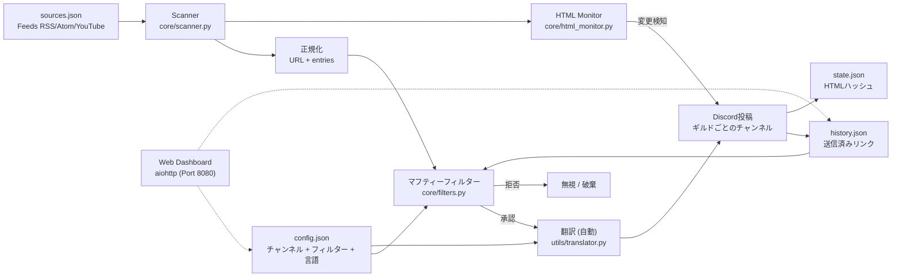
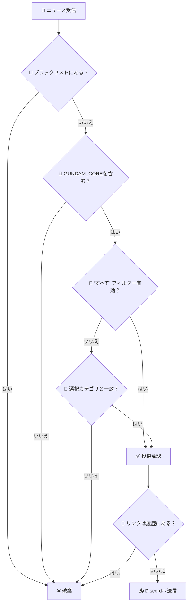

# 🛰️ Gundam News Bot — Mafty Intelligence System

<p align="center">
  
</p>

<p align="center">
  <a href="https://github.com/carmipa/gundam-news-discord/actions/workflows/python-app.yml">
    
  </a>
  
  
  
  
  
</p>

<p align="center">
  <b>ガンダムユニバースに関するRSS/Atom/YouTubeフィードのインテリジェント監視</b><br>
  外科的フィルタリング • インタラクティブ・ダッシュボード • Discordへの自動投稿
</p>

---

## 📋 目次

- [✨ 機能](#-機能)
- [🧱 アーキテクチャ](#-アーキテクチャ)
- [🚀 インストール](#-インストール)
- [⚙️ 設定](#️-設定)
- [🧰 コマンド](#-コマンド)
- [🎛️ ダッシュボード](#️-ダッシュボード)
- [🧠 フィルターシステム](#-フィルターシステム)
- [🖥️ デプロイ](#️-デプロイ)
- [🧩 トラブルシューティング](#-トラブルシューティング)
- [📜 ライセンス](#-ライセンス)

---

## ✨ 機能

| 機能 | 説明 |
|---------|-----------|
| 📡 **定期スキャナー** | RSS/Atom/YouTubeフィードを30分ごとにスキャン (設定可能) |
| 🕵️ **HTML Watcher** | RSSのない公式サイト (例: Gundam Official) の視覚的変化を監視 |
| 🎛️ **永続ダッシュボード** | 再起動後も機能するボタン付きインタラクティブパネル |
| 🎯 **カテゴリフィルター** | ガンプラ, 映画, ゲーム, 音楽, ファッション + "すべて"オプション |
| 🛡️ **アンチスパム** | ガンダムに関係のないアニメ/ゲームをブロックするブラックリスト |
| 🔄 **重複排除** | ニュースを重複させない (`history.json` に履歴を保存) |
| 🌐 **マルチギルド** | Discordサーバーごとの独立した設定 |
| 📝 **クリアなログ** | デバッグと監視のための詳細なメッセージ |
| 🎨 **リッチEmbed** | プレミアムな外観のニュース (ガンダムカラー, サムネイル, タイムスタンプ) |
| 🎞️ **ネイティブプレイヤー** | YouTube/Twitch動画をチャット内で直接再生 (ブラウザを開く必要なし) |
| 🌍 **多言語対応** | EN, PT, ES, IT, JA に対応 (自動検出 + `/setlang`) |
| 🖥️ **Webダッシュボード** | <http://host:8080> でリアルタイムステータスを表示するビジュアルパネル |
| 🧹 **自動クリーンアップ** | 7日ごとの自動キャッシュクリーニングでパフォーマンス維持 (メンテナンス不要) |
| ❄️ **コールドスタート** | 新しいソースからの最新ニュース3件を即座に投稿 (タイムロックを無視) |
| 🔐 **セキュアSSL** | certifiによる検証済み接続 (MITM保護) |

---

## 🧱 アーキテクチャ

### 1) マクロビュー — 完全なデータフロー



---

## 🚀 インストール

### 前提条件

- Python 3.10 以上
- Discord Bot トークン ([Developer Portal](https://discord.com/developers/applications))

### ステップバイステップ

```bash
# 1. リポジトリをクローン
git clone https://github.com/carmipa/gundam-news-discord.git
cd gundam-news-discord

# 2. 仮想環境を作成
python -m venv .venv

# Windows
.venv\Scripts\activate

# Linux/macOS
source .venv/bin/activate

# 3. 依存関係をインストール
pip install -r requirements.txt

# 4. 環境設定
cp .env.example .env
# .env をあなたのトークンで編集
```

---

## ⚙️ 設定

### 環境変数 (`.env`)

```env
# 必須
DISCORD_TOKEN=あなたのトークン

# オプション
COMMAND_PREFIX=!
LOOP_MINUTES=30
LOG_LEVEL=INFO  # 詳細なGRCログにはDEBUGを使用
```

### フィードソース (`sources.json`)

ボットは2つの形式を受け入れます:

<details>
<summary><b>📁 カテゴリ形式 (推奨)</b></summary>

```json
{
  "rss_feeds": [
    "https://www.animenewsnetwork.com/news/rss.xml",
  ],
  "youtube_feeds": [
    "https://www.youtube.com/feeds/videos.xml?channel_id=UCejtUitnpnf8Be-v5NuDSLw"
  ]
}
```

</details>

<details>
<summary><b>📁 公式サイト (HTML監視)</b></summary>
RSSのないサイトは別の配列に配置します。ボットはハッシュの変更をチェックします。

```json
{
  "official_sites_reference_(not_rss)": [
    "https://gundam-official.com/"
  ]
}
```

</details>

---

## 🧰 コマンド

| コマンド | タイプ | 説明 |
|---------|------|-----------|
| `/dashboard` | Slash | フィルター設定パネルを開く (管理者) |
| `/setlang` | Slash | サーバーのボット言語を設定 (管理者) |
| `/forcecheck` | Slash | 即時スキャンを強制実行 (管理者) |
| `/status` | Slash | ボットの統計を表示 (稼働時間, スキャン数など) |
| `/feeds` | Slash | 監視中の全ソースをリスト表示 |
| `/help` | Slash | ヘルプマニュアルを表示 |
| `/invite` | Slash | ボット招待リンク |

> **🔒 権限:** 管理者のみがこれらのコマンドを使用できます。

---

## 🎛️ ダッシュボード

インタラクティブパネルで監視カテゴリを設定できます:

| ボタン | 機能 |
|-------|--------|
| 🌟 **すべて** | 全カテゴリの切り替え |
| 🤖 **ガンプラ** | キット, プレバン, Ver.Ka, HG/MG/RG/PG |
| 🎬 **映画** | アニメ, 予告編, シリーズ, ハサウェイ, SEED |
| 🎮 **ゲーム** | ガンダムゲーム (バトオペ2, ブレイカーなど) |
| 🎵 **音楽** | OST, アルバム, OP/ED |
| 👕 **ファッション** | アパレル, グッズ |
| 📌 **フィルター確認** | アクティブなフィルターを表示 |
| 🔄 **リセット** | 全フィルターをクリア |

---

## 🧠 フィルターシステム

フィルタリングは **単純ではありません** — ボットは **階層化された** システムを使用して外科的な精度を保証します:

### 決定フロー



---

## 🖥️ デプロイ

### Docker (推奨)

```bash
docker-compose up -d
```

詳細は [DEPLOY.md](DEPLOY.md) を参照してください。

---

## 📜 ライセンス

このプロジェクトは **MIT License** の下でライセンスされています - 詳細は [LICENSE](LICENSE) ファイルをご覧ください。

---

<p align="center">
  🛰️ <i>マフティー・インテリジェンス・システム — 宇宙世紀の継続的な警戒</i>
</p>
