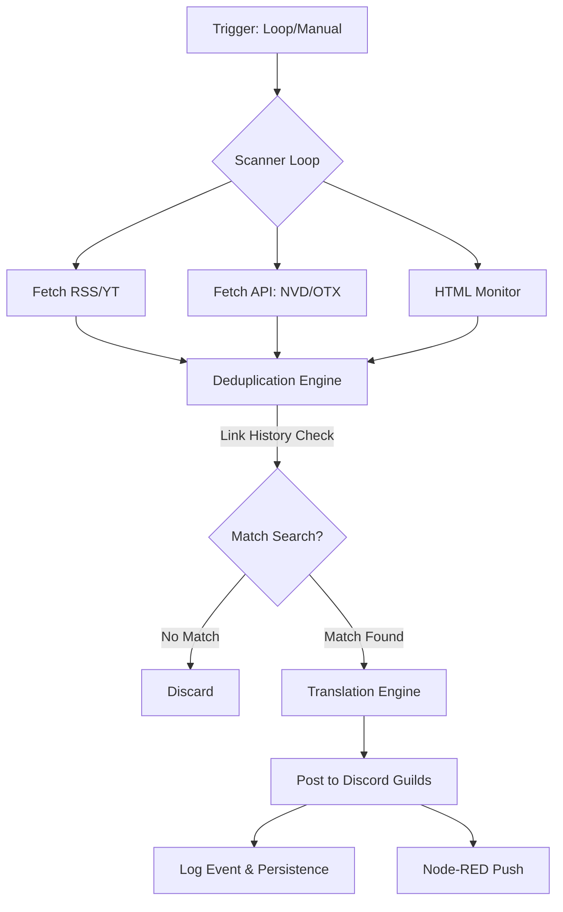

# 🔐 CyberIntel Bot — Sistema de Inteligência em Cibersegurança

  

  
  
  
  

  <b>Monitoramento Inteligente de Ameaças e Vulnerabilidades (RSS/YouTube/NVD/OTX)</b> 
  Análise Forense • Dashboard SOC • Postagem Instantânea • Hardening de VPS

---

## 📋 Índice

- [✨ Funcionalidades](#-funcionalidades)
- [🧱 Arquitetura e Engenharia](#-arquitetura-e-engenharia)
- [🧰 Comandos Slash (Guia Completo)](#-comandos-slash-guia-completo)
- [🚀 Instalação e VPS](#-instalação-e-vps)
- [⚙️ Filtros e Customização](#️-filtros-e-customização)
- [🛡️ Camada de Persistência](#️-camada-de-persistência)
- [📜 Licença](#-licença)

---

## ✨ Funcionalidades

| Recurso | Detalhes Técnicos |
|---------|-------------------|
| 📡 **Multi-Source Scanner** | Orquestra feeds RSS, Atom, YouTube e APIs de Threat Intel (NVD/OTX). |
| 🕵️ **HTML Watcher** | Motor de detecção de mudanças em sites oficiais baseado em hash (CISA, NIST). |
| 🎛️ **Node-RED SOC** | Dashboard visual integrado via Webhook para monitoramento de eventos. |
| 🔄 **Cold Start Logic** | Mecanismo que garante alerts instantâneos ao ligar o bot do zero. |
| 🌍 **Tradução Dinâmica** | Tradução automática via DeepL/Google API respeitando a linguagem por Guild. |
| 🔐 **Active Defense** | Honeypots internos para detecção de intrusão e exploração do bot. |
| 🟢 **Direct Share** | Botões customizados para WhatsApp e E-mail integrados aos embeds. |

---

## 🧱 Arquitetura e Engenharia

O CyberIntel foi construído seguindo o padrão de **Cogs (Módulos)** do `discord.py`, garantindo alta escalabilidade e separação de responsabilidades.

### Fluxo de Varredura de Inteligência

---

## 🧰 Comandos Slash (Guia Completo)

O bot utiliza **Slash Commands** para garantir uma interface moderna e segura. Aqui está a lista completa de comandos disponíveis:

### 📡 Inteligência e Status

| Comando | Nível | Descrição |
|---------|-------|-----------|
| `/news` | Todos | Exibe os 5 últimos alertas de segurança relevantes. |
| `/cve [id]` | Todos | Busca detalhes de uma vulnerabilidade específica ou lista as mais recentes. |
| `/scan [url]` | Todos | Analisa uma URL suspeita usando URLScan.io e VirusTotal. |
| `/status` | Todos | Mostra a saúde do bot (Uptime, CPU, RAM). |
| `/soc_status` | Todos | Verifica a conectividade com as APIs (NVD, OTX, VT). |
| `/ping` | Todos | Teste de latência com o servidor do Discord. |

### 🛠️ Configuração e Administração

| Comando | Nível | Descrição |
|---------|-------|-----------|
| `/set_channel` | Admin | Define o canal atual como o canal oficial para alertas do SOC. |
| `/forcecheck` | Admin | Força o bot a buscar novidades em todos os canais imediatamente. |
| `/now` | Admin | Dispara o loop de varredura manual com feedback visual. |
| `/post_latest` | Admin | **Força a postagem** da notícia #1 mais recente, ignorando o cache de histórico (Ideal para testes). |
| `/dashboard` | Admin | Obtém o link seguro e status do painel Node-RED. |

---

## 🛡️ Camada de Persistência

Para garantir que você nunca receba o mesmo alerta duas vezes, o CyberIntel utiliza uma estratégia de persistência em três camadas:

1. **`history.json`**: Armazena os últimos 2.000 links processados para uma deduplicação extremamente rápida ("Dedupe").
2. **`data/database.json`**: Módulo de banco de dados SQLite/JSON que registra a data e o conteúdo de cada notícia enviada, útil para auditoria e relatórios.
3. **`state.json`**: Salva o estado volátil do scanner (última varredura bem-sucedida, hashes HTML e cache de estatísticas).

> [!TIP]
> **Modo Cold Start:** Quando o bot inicia com o histórico em branco, ele entra em modo "Cold Start", postando as 3 notícias mais recentes de cada feed para garantir que você não perca os destaques enquanto o bot esteve offline.

---

## ⚙️ Filtros e Customização

O sistema de filtragem (`core/filters.py`) é o diferencial do CyberIntel. Ele utiliza lógica booleana ponderada:

- **Blacklist Automática**: Bloqueia palavras-chave como "casino", "poker", "dating" para limpar o feed de spam.
- **Categorização Inteligente**: Identifica se o conteúdo é sobre Malware, Ransomware, Ransomware-as-a-Service (RaaS) ou Zero-Day.
- **Filtro CVSS**: Vulnerabilidades da NVD são filtradas automaticamente para mostrar apenas as de impacto **Alto ou Crítico (CVSS > 7.0)**.

---

## 🚀 Instalação e VPS

Para o guia detalhado de como hospedar o bot em uma VPS (Oracle Cloud, DigitalOcean, AWS) usando Docker, consulte o nosso guia dedicado:

👉 **[GUIA DE DEPLOY (DOCKER/VPS)](./DEPLOY.md)**

---

## 📜 Licença

Desenvolvido por **Paulo Carminati**. Este projeto é open-source sob a licença MIT.

---

  🔐 <i>CyberIntel SOC — Inteligência Defensiva Proativa.</i>

