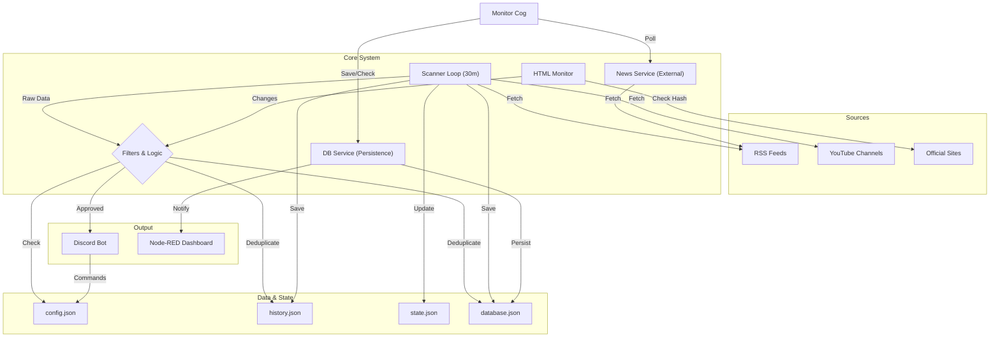

# 🔐 CyberIntel Bot — Sistema de Inteligência em Cibersegurança

<p align="center">
  
</p>

<p align="center">
  <a href="https://github.com/carmipa/cyberintel-discord"></a>
  <a href="https://www.python.org/"></a>
  
  <a href="LICENSE"></a>
</p>

<p align="center">
  <b>Monitoramento Inteligente de Feeds de Cibersegurança (RSS/Atom/YouTube)</b><br>
  Filtragem Cirúrgica • Dashboard Interativo • Postagem Automática no Discord • Persistência de Dados
</p>

---

## 📋 Índice

- [✨ Funcionalidades](#-funcionalidades)
- [🧱 Arquitetura Detalhada](#-arquitetura-detalhada)
- [🚀 Instalação Passo-a-Passo](#-instalação-passo-a-passo)
- [⚙️ Configuração Avançada](#️-configuração-avançada)
- [🧰 Comandos](#-comandos)
- [🎛️ Dashboard](#️-dashboard)
- [🔧 Solução de Problemas](#-solução-de-problemas-troubleshooting)
- [📜 Licença](#-licença)

---

## ✨ Funcionalidades

| Recurso | Descrição |
|---------|-----------|
| 📡 **Scanner Periódico** | Varredura de feeds RSS/Atom/YouTube a cada 30 minutos (configurável). |
| 🕵️ **HTML Watcher** | Monitora sites oficiais sem RSS (ex: CISA, NIST) detectando mudanças visuais. |
| 🎛️ **Dashboard Persistente** | Painel interativo com botões que funciona mesmo após reinicialização. |
| 🎯 **Filtros por Categoria** | Malware, Ransomware, Vulnerabilidade, Exploit + opção "TUDO". |
| 🛡️ **Anti-Spam** | Blacklist para bloquear notícias genéricas ou irrelevantes. |
| 🔄 **Deduplicação Inteligente** | Nunca repete notícias (histórico em `history.json` e `database.json`). |
| 💾 **Persistência de Dados** | Monitoramento de envio de notícias com base de dados local (`data/database.json`). |
| 🌐 **Integração Node-RED** | Envio de notificações para dashboards externos via webhook. |
| 🎨 **Embeds Ricos** | Estilo visual Premium (Verde Matrix, thumbnails, timestamps). |
| 🎞️ **Player Nativo** | Vídeos do YouTube/Twitch tocam direto no chat. |
| 🌍 **Multi-Idioma** | Suporte a EN, PT, ES, IT, JA (detecção automática + `/setlang`). |
| 🔐 **SSL Seguro** | Conexões verificadas com certifi (proteção contra MITM). |

---

## 🧱 Arquitetura Detalhada

O diagrama abaixo ilustra o fluxo de dados desde a coleta até a distribuição. O sistema foi projetado para ser modular, resiliente e auditável.



### Componentes Principais

1. **Scanner Loop**: O coração do sistema. Executa a cada `LOOP_MINUTES` (padrão: 30m). Ele orquestra a coleta de dados de todas as fontes configuradas.
2. **Filtros & Lógica**: Aplica regras rigorosas:
    - *Blacklist*: Bloqueia termos irrelevantes (casino, dating, etc.).
    - *Core Keywords*: Garante que o conteúdo é estritamente sobre cibersegurança.
    - *Categorização*: Classifica em Malware, Ransomware, etc.
3. **Persistência (DBService)**: Garante que nenhuma notícia seja enviada em duplicidade, mantendo um hash de todos os links já processados em `database.json`.
4. **Monitor Cog**: Um módulo independente que roda em paralelo para buscar "Breaking News" de fontes de altíssima prioridade, garantindo alertas quase em tempo real.

---

## 🚀 Instalação Passo-a-Passo

### Pré-requisitos

- **Python 3.10 ou superior**: [Download Python](https://www.python.org/downloads/)
- **Git**: [Download Git](https://git-scm.com/downloads)
- **Conta no Discord**: Para criar a aplicação e convidar o bot.

### Procedimento

1. **Clonar o Repositório**

    ```bash
    git clone https://github.com/carmipa/cyberintel-discord.git
    cd cyberintel-discord
    ```

2. **Configurar Ambiente Virtual (Recomendado)**
    Isso isola as dependências do projeto para não conflitar com seu sistema.

    ```bash
    python -m venv .venv
    
    # Ativar no Windows:
    .venv\Scripts\activate
    
    # Ativar no Linux/Mac:
    source .venv/bin/activate
    ```

3. **Instalar Dependências**

    ```bash
    pip install -r requirements.txt
    ```

    *Se houver erro de instalação, atualize o pip: `pip install --upgrade pip`*

4. **Configuração de Variáveis (.env)**
    Copie o arquivo de exemplo e edite:

    ```bash
    cp .env.example .env
    ```

    Abra o `.env` e preencha:
    - `DISCORD_TOKEN`: Seu token obtido no [Discord Developer Portal](https://discord.com/developers/applications).
    - `DISCORD_NEWS_CHANNEL_ID`: ID do canal onde as notícias serão postadas (ative o Modo Desenvolvedor no Discord para clicar com botão direito e "Copiar ID").

5. **Executar o Bot**

    ```bash
    python main.py
    ```

---

## ⚙️ Configuração Avançada

### `sources.json`

Este arquivo controla onde o bot busca informações. A estrutura deve ser mantida rigorosamente:

```json
{
  "rss_feeds": [
    "https://feeds.feedburner.com/TheHackersNews",
    "https://www.bleepingcomputer.com/feed/"
  ],
  "youtube_feeds": [
    "https://www.youtube.com/feeds/videos.xml?channel_id=UC9-y-6csu5WGm29I7JiwpnA"
  ],
   "official_sites_reference_(not_rss)": [
    "https://www.cisa.gov/cybersecurity-alerts-and-advisories"
  ]
}
```

- **rss_feeds**: Lista de URLs RSS/Atom diretas.

- **youtube_feeds**: Links RSS de canais do YouTube (não use o link do canal direto, use o formato RSS).

### `config.json`

Gerado automaticamente. Armazena as preferências de cada servidor (Guild). **Não edite manualmente** a menos que o bot esteja desligado.
Exemplo de estrutura interna:

```json
{
  "123456789012345678": {
    "channel_id": 987654321098765432,
    "language": "pt_BR",
    "filters": ["malware", "ransomware", "zero-day"]
  }
}
```

---

## 🔧 Solução de Problemas (Troubleshooting)

### O bot conecta mas não posta nada

1. Verifique se o `DISCORD_NEWS_CHANNEL_ID` está correto no `.env`.
2. Verifique as permissões do bot no canal. Ele precisa de: **View Channel**, **Send Messages**, **Embed Links**.
3. Aguarde o ciclo de 30 minutos ou use o comando `/forcecheck`.

### Erros de "Intents"

Se receber erro sobre "Privileged Intents":

1. Vá ao [Discord Developer Portal](https://discord.com/developers/applications).
2. Selecione seu App -> Bot.
3. Role até "Privileged Gateway Intents".
4. Ative **Message Content Intent** e **Server Members Intent**.

### Diagramas quebrados no README

Se os diagramas não renderizarem, certifique-se de que está visualizando no GitHub (que suporta Mermaid nativamente) ou use um visualizador Markdown compatível (VS Code com extensão Mermaid).

---

## 📜 Licença

Este projeto está licenciado sob a **MIT License**. Consulte o arquivo LICENSE para mais detalhes.

---

<p align="center">
  🔐 <i>Sistema CyberIntel — Proteja a rede. Proteja o futuro.</i>
</p>
