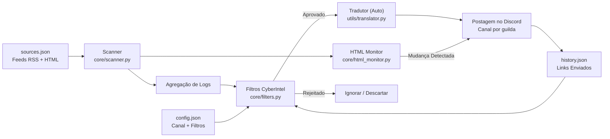

# 🔐 CyberIntel Bot — Sistema de Inteligência em Cibersegurança

<p align="center">
  
</p>

<p align="center">
  
  
  
  
</p>

<p align="center">
  <b>Monitoramento Inteligente de Feeds de Cibersegurança (RSS/Atom/YouTube)</b><br>
  Filtragem Cirúrgica • Dashboard Interativo • Postagem Automática no Discord
</p>

---

## 📋 Índice

- [✨ Funcionalidades](#-funcionalidades)
- [🧱 Arquitetura](#-arquitetura)
- [🚀 Instalação](#-instalação)
- [⚙️ Configuração](#️-configuração)
- [🧰 Comandos](#-comandos)
- [🎛️ Dashboard](#️-dashboard)
- [🧠 Sistema de Filtros](#-sistema-de-filtros)
- [🖥️ Deploy](#️-deploy)
- [📜 Licença](#-licença)

---

## ✨ Funcionalidades

| Recurso | Descrição |
|---------|-----------|
| 📡 **Scanner Periódico** | Varredura de feeds RSS/Atom/YouTube a cada 30 minutos (configurável). |
| 🕵️ **HTML Watcher** | Monitora sites oficiais sem RSS (ex: CISA, NIST) detectando mudanças visuais. |
| 🎛️ **Dashboard Persistente** | Painel interativo com botões que funciona mesmo após reinicialização. |
| 🎯 **Filtros por Categoria** | Malware, Ransomware, Vulnerabilidade, Exploit + opção "TUDO". |
| 🛡️ **Anti-Spam** | Blacklist para bloquear notícias genéricas ou irrelevantes. |
| 🔄 **Deduplicação** | Nunca repete notícias (histórico em `history.json`). |
| 🌐 **Multi-Guild** | Configuração independente por servidor Discord. |
| 🎨 **Embeds Ricos** | Estilo visual Premium (Verde Matrix, thumbnails, timestamps). |
| 🎞️ **Player Nativo** | Vídeos do YouTube/Twitch tocam direto no chat. |
| 🌍 **Multi-Idioma** | Suporte a EN, PT, ES, IT, JA (detecção automática + `/setlang`). |
| 🔐 **SSL Seguro** | Conexões verificadas com certifi (proteção contra MITM). |

---

## 🧱 Arquitetura

### Fluxo de Dados



---

## 🚀 Instalação

### Pré-requisitos

- Python 3.10+
- Token do Bot Discord ([Portal de Desenvolvedores](https://discord.com/developers/applications))

### Início Rápido

```bash
# 1. Clonar repositório
git clone https://github.com/carmipa/cyberintel-discord.git
cd cyberintel-discord

# 2. Criar ambiente virtual
python -m venv .venv
# .venv\Scripts\activate   # Windows
source .venv/bin/activate  # Linux/Mac

# 3. Instalar dependências
pip install -r requirements.txt

# 4. Configurar ambiente
cp .env.example .env
# Edite o .env com seu token
```

---

## ⚙️ Configuração

### Variáveis de Ambiente (`.env`)

```env
DISCORD_TOKEN=seu_token_aqui
COMMAND_PREFIX=!
LOOP_MINUTES=30
LOG_LEVEL=INFO
```

### Fontes de Feeds (`sources.json`)

```json
{
  "rss_feeds": [
    "https://feeds.feedburner.com/TheHackersNews",
    "https://www.bleepingcomputer.com/feed/"
  ],
  "youtube_feeds": [
    "https://www.youtube.com/feeds/videos.xml?channel_id=UC9-y-6csu5WGm29I7JiwpnA"
  ]
}
```

---

## 🧰 Comandos

| Comando | Tipo | Descrição |
|---------|------|-----------|
| `/dashboard` | Slash | Abre painel de configuração de filtros (Admin) |
| `/setlang` | Slash | Define o idioma do bot para o servidor (Admin) |
| `/forcecheck` | Slash | Força uma varredura imediata (Admin) |
| `/status` | Slash | Mostra estatísticas do bot (Uptime, Scans) |
| `/feeds` | Slash | Lista todas as fontes monitoradas |

---

## 🎛️ Dashboard

O painel interativo permite configurar quais categorias monitorar:

- 🦠 **Malware**
- 🔒 **Ransomware**
- 🛡️ **Vulnerabilidade**
- 💥 **Exploit**
- 🕵️ **Zero-Day**

---

## 📜 Licença

Este projeto está licenciado sob a **MIT License**.

---

<p align="center">
  🔐 <i>Sistema CyberIntel — Proteja a rede. Proteja o futuro.</i>
</p>
