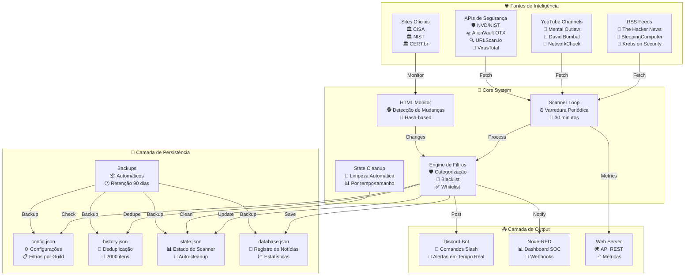
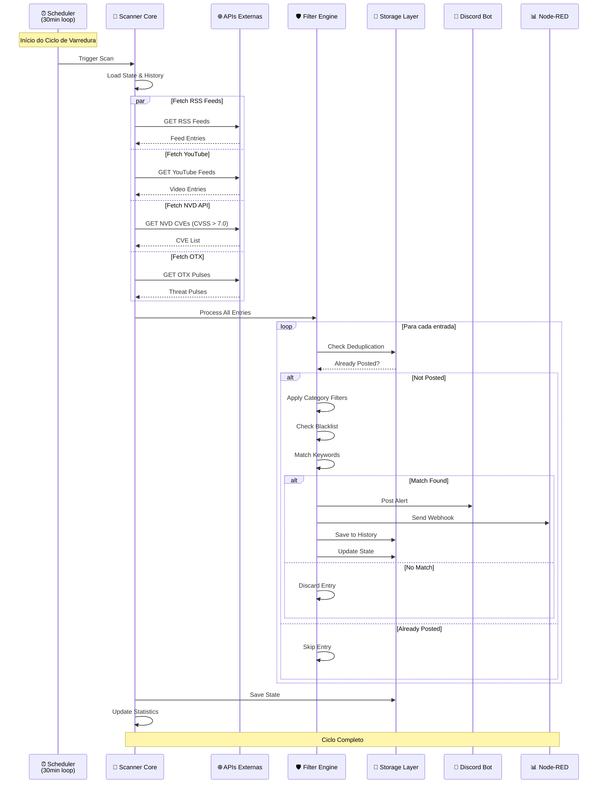
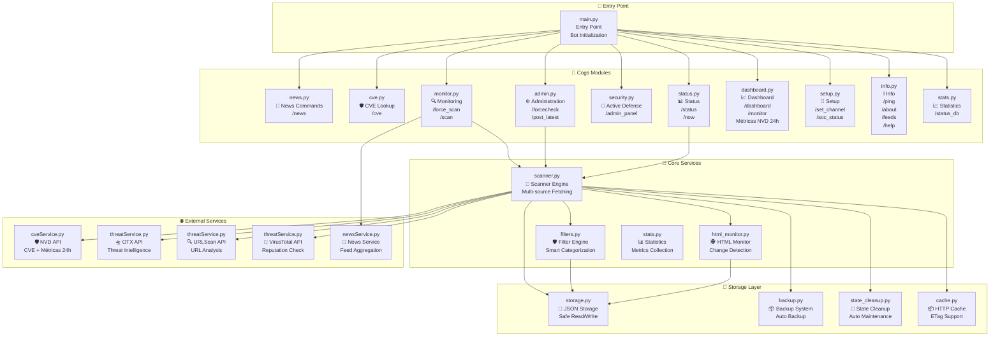
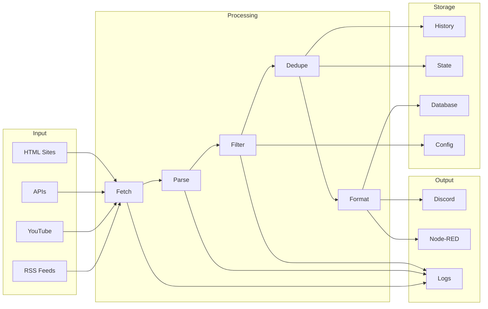
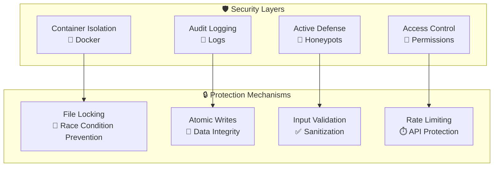
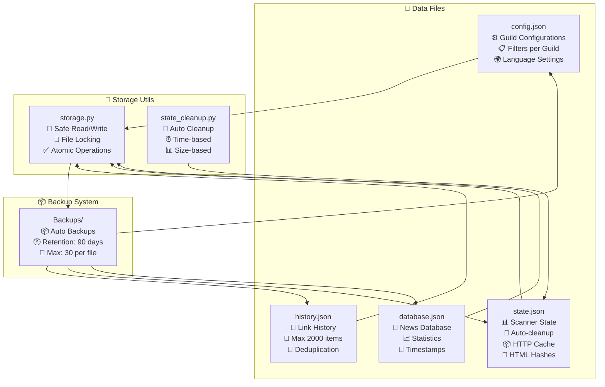
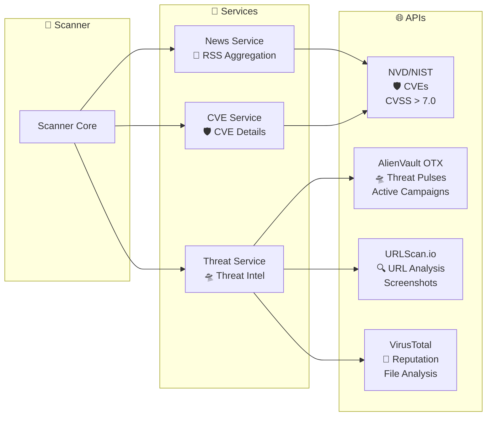
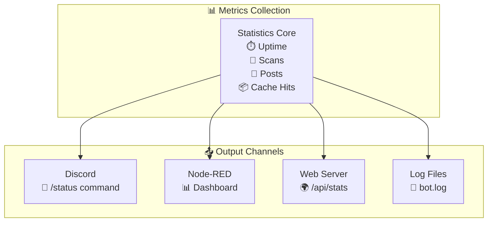
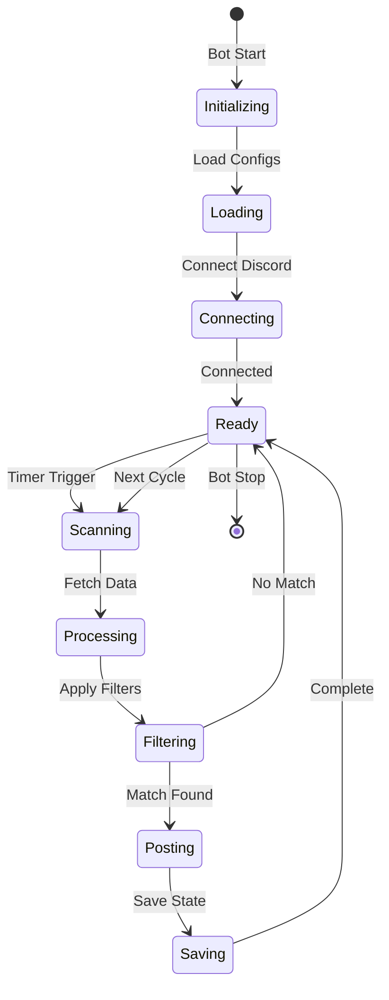

# 🏗️ Arquitetura do CyberIntel SOC Bot

**Documentação Técnica da Arquitetura do Sistema**

---

## 📐 Visão Geral da Arquitetura

O CyberIntel SOC Bot foi projetado seguindo princípios de **arquitetura modular**, **separação de responsabilidades** e **alta escalabilidade**. O sistema utiliza o padrão **Cogs** do `discord.py` para garantir modularidade e facilidade de manutenção.

---

## 🎯 Diagrama de Arquitetura Geral

---

## 🔄 Fluxo de Processamento de Inteligência

### Check de conectividade e resiliência do Scanner

Antes de iniciar o download dos feeds, o **Scanner** (`core/scanner.py`) executa:

1. **Check-up de conectividade**  
   Tenta uma conexão TCP rápida com o DNS do Google (`8.8.8.8:53`) com timeout de 3 segundos.  
   - Se falhar: a varredura é **abortada** e o log registra `[WARN] Rede indisponível. Postergando scan.`  
   - Se ok: segue para o fetch dos feeds.

2. **User-Agent de navegador**  
   Todas as requisições HTTP usam um User-Agent de navegador real (Chrome/Windows) para reduzir bloqueios (403/timeout) em sites como CISA.

3. **Resiliência por feed**  
   Cada feed é baixado com timeout de 30 segundos e até **3 tentativas** com intervalo de 5 segundos em caso de `TimeoutError`; após a 3ª falha, o feed é ignorado e apenas um aviso é registrado no log.

---

## 🧩 Arquitetura Modular (Cogs)

---

## 📊 Fluxo de Dados

---

## 🔐 Camada de Segurança

---

## 💾 Estrutura de Persistência

---

## 🌐 Integração com APIs Externas

---

## 📈 Monitoramento e Telemetria

---

## 🔄 Ciclo de Vida do Bot

---

## 📚 Referências Arquiteturais

- **Padrão Cogs**: Modularização do discord.py
- **Separation of Concerns**: Cada módulo tem responsabilidade única
- **Dependency Injection**: Serviços injetados via bot instance
- **Observer Pattern**: Eventos do Discord
- **Strategy Pattern**: Filtros configuráveis por guild

---

**🏗️ Arquitetura Modular e Escalável**

[⬆ Voltar ao README](./README.md)

