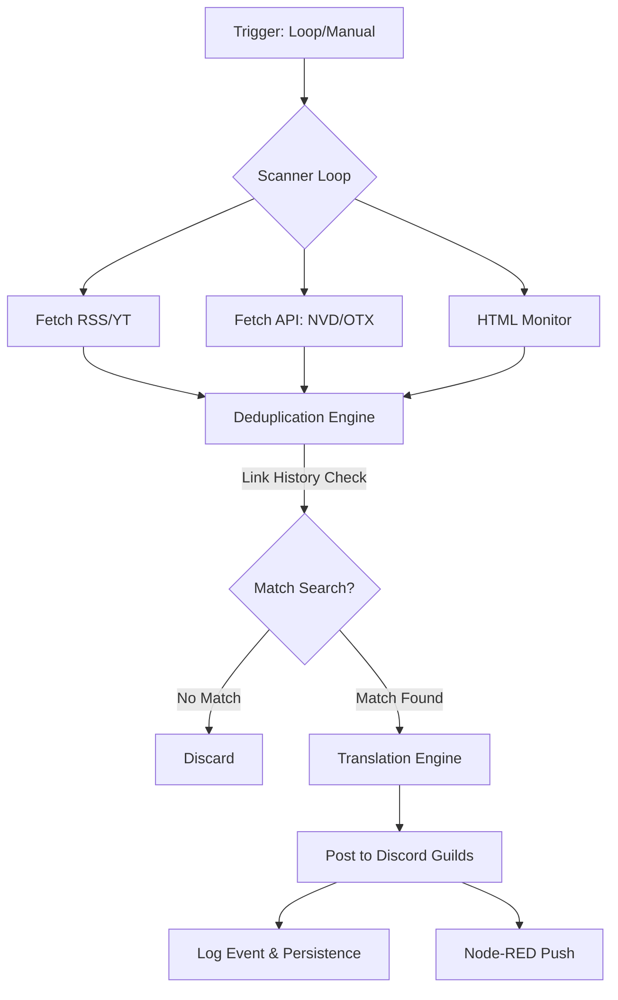

# 🔐 CyberIntel Bot — Cybersecurity Intelligence System

  

  
  
  
  

  <b>Intelligent Threat and Vulnerability Monitoring (RSS/YouTube/NVD/OTX)</b> 
  Forensic Analysis • SOC Dashboard • Instant Posting • VPS Hardening

---

## 📋 Table of Contents

- [✨ Features](#-features)
- [🧱 Architecture and Engineering](#-architecture-and-engineering)
- [🧰 Slash Commands (Full Guide)](#-slash-commands-full-guide)
- [🚀 Installation and VPS](#-installation-and-vps)
- [⚙️ Filters and Customization](#️-filters-and-customization)
- [🛡️ Persistence Layer](#️-persistence-layer)
- [📜 License](#-license)

---

## ✨ Features

| Feature | Technical Details |
|---------|-------------------|
| 📡 **Multi-Source Scanner** | Orchestrates RSS, Atom, YouTube feeds, and Threat Intel APIs (NVD/OTX). |
| 🕵️ **HTML Watcher** | Hash-based change detection engine for official sites (CISA, NIST). |
| 🎛️ **Node-RED SOC** | Integrated visual dashboard via Webhook for event monitoring. |
| 🔄 **Cold Start Logic** | Mechanism that ensures instant alerts when starting the bot from scratch. |
| 🌍 **Dynamic Translation** | Automatic translation via DeepL/Google API respecting per-Guild language. |
| 🔐 **Active Defense** | Internal Honeypots for intrusion detection and bot exploitation monitoring. |
| 🟢 **Direct Share** | Custom WhatsApp and Email buttons integrated into embeds. |

---

## 🧱 Architecture and Engineering

CyberIntel is built following the **Cogs (Modules)** pattern from `discord.py`, ensuring high scalability and separation of concerns.

### Intelligence Gathering Flow

---

## 🧰 Slash Commands (Full Guide)

The bot uses **Slash Commands** to ensure a modern and secure interface. Here is the full list of available commands:

### 📡 Intelligence and Status

| Command | Level | Description |
|---------|-------|-------------|
| `/news` | All | Displays the last 5 relevant security alerts. |
| `/cve [id]` | All | Fetch details for a specific vulnerability in NVD (e.g. CVE-2021-44228). |
| `/scan [url]` | All | Analyzes a suspicious URL using URLScan.io and VirusTotal. |
| `/status` | All | Shows bot health (Uptime, CPU, RAM, stats). |
| `/soc_status` | All | Verifies connectivity with APIs (NVD, OTX, VT). |
| `/ping` | All | Latency test with Discord servers. |
| `/about` | All | Technical system information. |
| `/feeds` | All | List of monitored feeds and sources. |
| `/help` | All | List of available commands. |

### 🖥️ Dashboard and Monitoring

| Command | Level | Description |
|---------|-------|-------------|
| `/dashboard` | All | SOC Dashboard (Node-RED) access and **NVD 24h metrics** (critical/high). |
| `/monitor` | All | SOC status and link to open the panel in real time. |

### 🛠️ Configuration and Administration

| Command | Level | Description |
|---------|-------|-------------|
| `/set_channel` | Admin | Sets the current channel as the official SOC alert channel. |
| `/forcecheck` | Admin | Forces the bot to search for news in all channels immediately. |
| `/force_scan` | Admin | Force scan and post new items to channel. |
| `/now` | Admin | Triggers the manual scan loop with visual feedback. |
| `/post_latest` | Admin | **Force posts** the #1 latest news, bypassing the history cache (Ideal for testing). |
<<<<<<< HEAD
| `/dashboard` | Admin | Gets the secure link and status of the Node-RED panel. |
=======
| `/server_log` | Admin | Shows the latest lines of the server log (`logs/bot.log`) directly in Discord. |
| `/status_db` | Admin | Intelligence database statistics. |

### 🔐 Security (Active Defense)

| Command | Level | Description |
|---------|-------|-------------|
| `/admin_panel` | Owner (OWNER_ID) | Owner-only panel; anyone else is logged as intruder (honeypot). |

📖 **Full reference table:** [COMANDOS_BOT.md](./COMANDOS_BOT.md) — every command and what it does.
>>>>>>> e6e17d139efd2da7fdccb33cb6670f565001f466

---

## 🛡️ Persistence Layer

To ensure you never receive the same alert twice, CyberIntel uses a three-layer persistence strategy:

1. **`history.json`**: Stores the last 2,000 processed links for extremely fast deduplication ("Dedupe").
2. **`data/database.json`**: SQLite/JSON database module that records the date and content of every news item sent, useful for auditing and reporting.
3. **`state.json`**: Saves the volatile state of the scanner (last successful scan, HTML hashes, and stats cache).

> [!TIP]
> **Cold Start Mode:** When the bot starts with a blank history, it enters "Cold Start" mode, automatically posting the 3 most recent news items from each feed to ensure you don't miss highlights while the bot was offline.

---

## ⚙️ Filters and Customization

The filtering system (`core/filters.py`) is CyberIntel's standout feature. It uses weighted Boolean logic:

- **Automatic Blacklist**: Blocks keywords like "casino", "poker", "dating" to clear spam.
- **Smart Categorization**: Identifies if content is about Malware, Ransomware, Ransomware-as-a-Service (RaaS), or Zero-Day.
- **CVSS Filter**: Vulnerabilities from the NVD are automatically filtered to show only **High or Critical (CVSS > 7.0)** impact alerts.

---

## 🚀 Installation and VPS

For a detailed guide on how to host the bot on a VPS (Oracle Cloud, DigitalOcean, AWS) using Docker, see our dedicated guide:

👉 **[DEPLOYMENT GUIDE (DOCKER/VPS)](./DEPLOY.md)**

---

## 📜 License

Developed by **Paulo Carminati**. This project is open-source under the MIT license.

---

  🔐 <i>CyberIntel SOC — Proactive Defensive Intelligence.</i>

